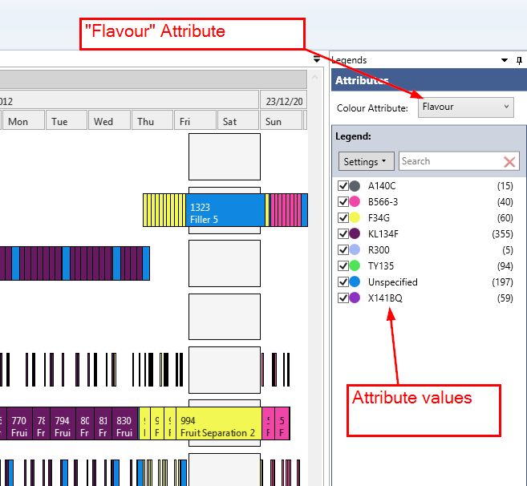
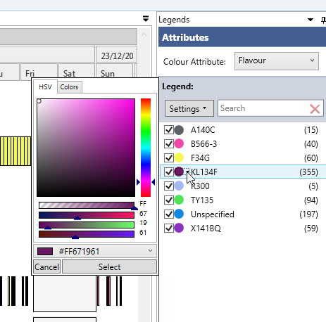
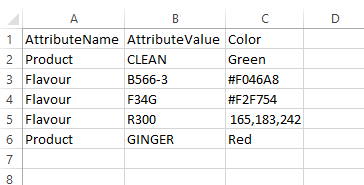

By default Rantt will automatically assign colors to operations based on the attribute selected in the legend control and their corresponding values.

Manual Colors
=============

You can manually change the colors by clicking on the color disks:

In order to preserve these colors you will have to create and save a workspace.

Colors.csv File
===============

A Colors.csv file can also be provided, which will define the colors to associate with attribute values.
This file must be saved in the same folder as the Rantt project file.

The Colors.csv file must have 3 columns:

-   AttributeName
-   AttributeValue
-   Color

When Rantt loads a project it will automatically check for the existence of this **Colors.csv** file. If there is one it will use the colors supplied for the attribute name/values.

Color Formats
--------------

The "Color" column in the csv file can specify colors in three formats:

-   English
-   Hexadecimal
-   RGB

For a list of supported English color codes please visit this page: [http://www.rapidtables.com/web/color/RGB_Color.htm](http://www.rapidtables.com/web/color/RGB_Color.htm)

**Note:** 

> When using English color codes, do not include spaces. e.g. "light steel blue" should be written "lightsteelblue".
