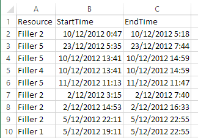
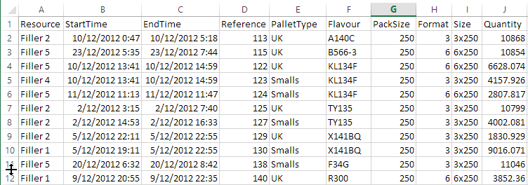
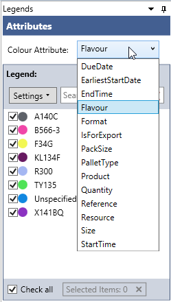
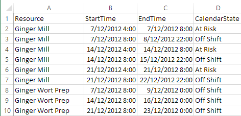

Prerequisites
--------------

- Framework: .NET 4.5
- CPU:  1.7 GHz
- RAM: 2 GB

Installation
------------

Double click on the executable and follow through the prompts.

The program will be installed in "C:\Program Files (x86)\Wild Gums\Rantt for Desktop"

Sample project files can also be found in this installation folder under the following folder names:
- ActualPlanned (two datasets are defined in the same project)
- Elsinore (Operations and Calendar)
- FinoFlex (Operations and Calendar)
- Globex (Operations and Operation Relationships)
- MultiDataset (Multiple Datasets)
- CurrentTime (only Operations)

Workspaces and settings files are saved in %AppData%/Wild Gums/Rantt

Required Data
-------------

The Rantt application needs a project file (.rprj) file in order to know where to get its data from. Data can either be stored in csv, Excel files or database tables (or views).

A project can include multiple datasets.

A dataset is made up of:
- An operations file (compulsory)
- A calendar file (optional)
- An Operation Relationships file (optional)

For more information on how to create a project file, please visit the Rantt Project Creator page.

### Operation csv file

The minimum required fields in order to display operations on the Gantt chart are:
- Resource
- Start time
- End time

 
The wording in the column header is insignificant but will need to mapped to the required fields during the project creation.

Other fields may be included and will be available as contextual information associated with the operation. 
The visibility of these additional fields can be fully customized. An example of a csv file with multiple fields is shown below.

These additional fields will be used by Rantt to facilitate the analysis of your data by:

1. Being visible as tooltips when hovering over the operation

2. Allowing you to colour operations by the value of these fields via the legend control

### Calendar Periods csv file

This file is optional and contains a row for each period of time you want to display on the Gantt.

Generally "Off Shift" periods are worth displaying in order to provide a better understanding of the schedule.

A calendar period is defined by:
- Name of the Calendar State
- The resource it affects
- Start time
- End time

This data file will look like the picture shown below:

Each calendar period will by default be displayed as a grey rectangle. The colour for a particular calendar state can be changed from the "Legend Control" as shown below:

### Operation Relationships csv file

The fields required in this file are:
- From
- To
 
 These fields will hold a unique identifier number for each operation.
 In order for this file to work with Rantt, the Operations.csv file will need an extra "Reference" column, which will contain the unique identifier for each operation.
 
When you right click an operation and if this operation is mentioned in the OperationRelationships csv file, then three right click options are shown.
- Show Parent Relationships
- Show child Relationships
- Show All Relationships
 
TODO: Show relationship lines
 
 