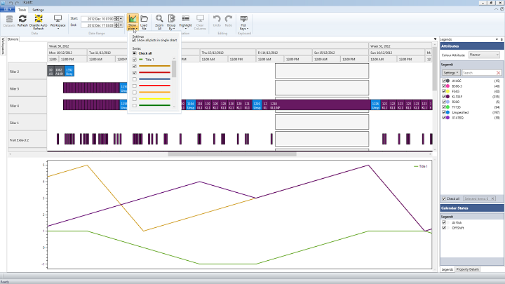
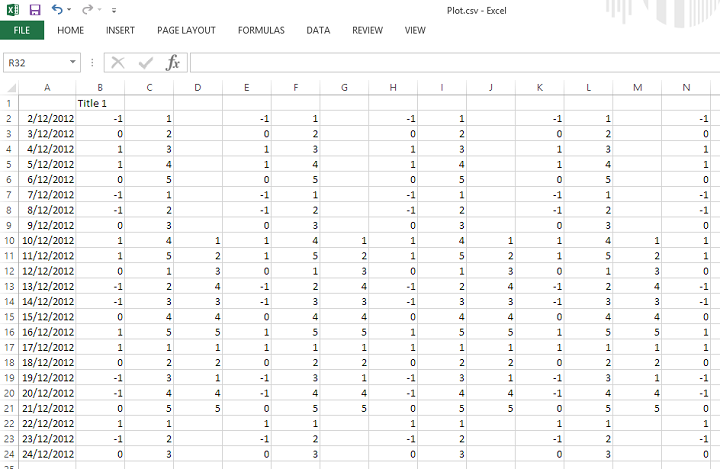
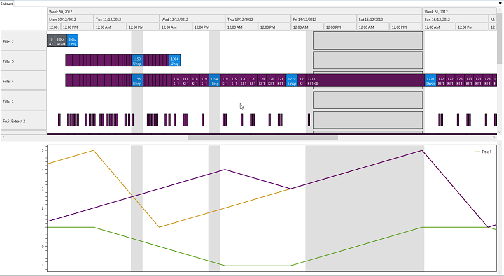

Rantt allows you to visualise plots that are totally independent from the gantt chart, but share the same date range.

This feature is useful if you want to see how various plots are related to a schedule, such as:

- Tidal plots for a port
- Stock levels of products
- Energy consumption of a factory

Features
=========

- Display multiple plots in their own window (beneath the Gantt chart)
- Display plots in the same chart or individual charts
- Enable/Disable plots on the fly
- Plots are fully synced with the Gantt chart navigation. (i.e. Zoom or pan the Gantt chart and the plots will adjust accordingly, and vice versa)
- Highlight columns in the Gantt chart will also be displayed in the plot area, which makes it easy to see what overlaps with a given time window

File Structure
==============

If a 'Plot.csv' file is found in the same folder as the project file it will automatically be loaded when you click on the "Plots" button.

You can also have plot files with different names, which you can load manually.

The plot files need at least 2 columns. The first column will hold values for the x-axis and the second column will hold values for the y-axis. Any subsequent columns filled with data will represent a new plot.

Rules
------

An independent plot file must have:

- At least two columns
- First column always contains the x-axis values
- First row always contains the plot legends (If a plot does not have a legend, leave the first cell blank and a legend will automatically be assigned to the column)
- A column can have blank cells at the top and/or the bottom but not in the middle

Highlight Columns
==================

In order to enable a highlight column, CTRL + click on any operation in the Gantt chart area. To disable it, CTRL + click on the same operation.

