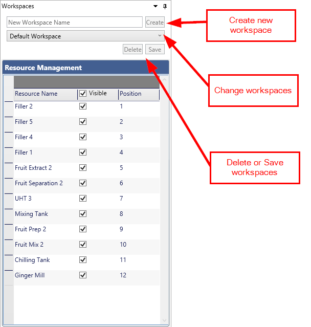
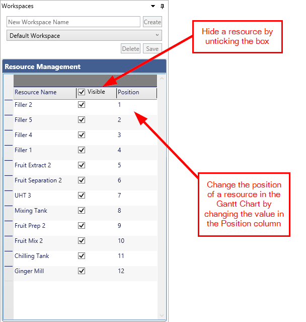
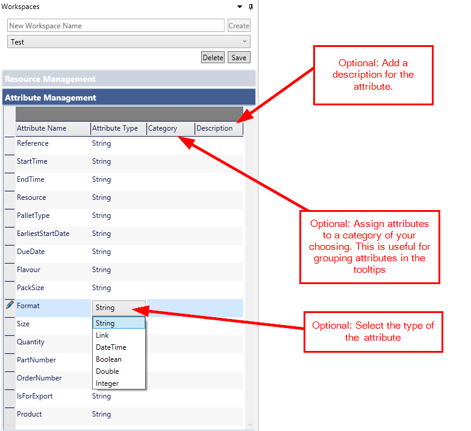
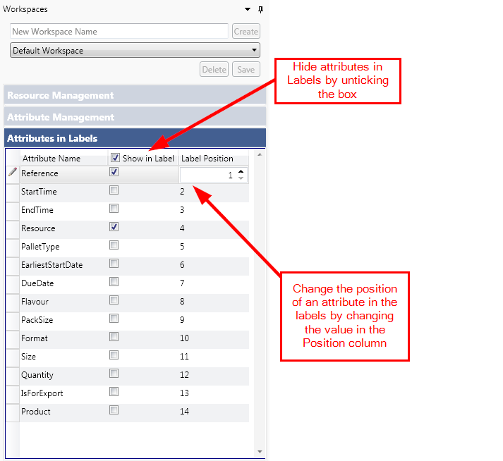
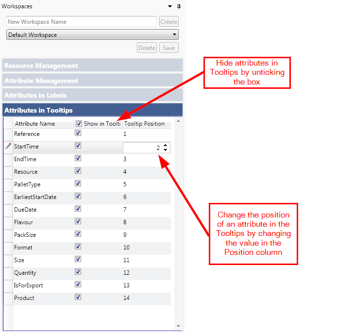
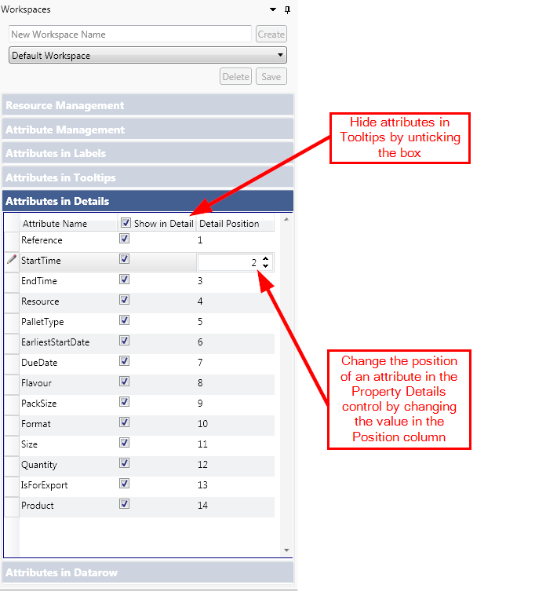

# Workspace Settings2

 Hello there
 
A workspace allows you to:

- Configure the Gantt chart exactly the way you want it to look.
- Store all your settings under a convenient name.
- Switch settings quickly and easily.

Once a workspace is saved you can easily switch between different workspaces you have created.
When you select a workspace from the drop down box, all the settings for the workspace will be restored.

To create a new workspace:

- Enter a name in the text box and click on the create button.
- Make the changes you require on the Gantt chart.
- Click the save button.

New settings can be added to an existing workspace by clicking on the save button at any time.

NOTE: Please note all settings described on this page are optional.

## Resources Management

- Show or hide a resource from the Gantt chart by ticking or unticking the check boxes.
- Change the position of a resource in the Gantt chart by double clicking on the position cell and changing the value.

## Attribute Management

- Change the type of an attribute. The various types are:
    - String
    - Link
    - DateTime
    - Boolean
    - Double
    - Integer
- Assign the attribute to a category. Attributes with the same category will be grouped together in the tooltips. 
- Add a description to the attributes.

## Attributes in Labels

-  Show or hide attributes in Labels, by ticking or unticking the check boxes.
-  Change the position of each attribute in the labels by double clicking on the position cell and changing the value.

## Attributes in Tooltips

The Attributes in Tooltips panel allows user to:

-  Show / hide tooltips on Gantt Chart, by toggling the check boxes.
-  Change the position of each tooltip on Gantt Chart by double clicking on the position cell and changing the value.

## Attributes in Details

-  Show or hide details on the Property Details control, by ticking or unticking the check boxes.
-  Change the position of each detail on the Property Details Control by double clicking on the position cell and changing the value.

## Attributes in Datarow

-  Show or hide the attribute from the Data Row, by ticking or unticking the check boxes.
-  Change the position of each datarow on Gantt Chart by double clicking on the position cell  and changing the value.
-  Change the format of datarow by double clicking on Format cell and selecting the appropriate format.

The various formats for a number like 12345.678 are:

- Compact: 12346
- Fixed point(2): 12345.68
- Fixed point(1): 12345.7
- Nearest integer: 12346
- Scientific: 1.2E+04

NOTE: In order for an attribute to be displayed in the DataRow, it needs to be of a numeric type, otherwise the value displayed will be 0.

 
