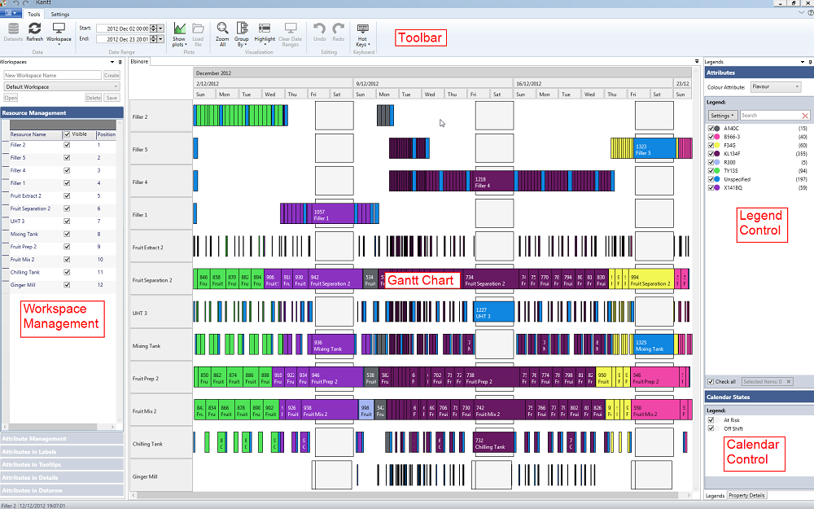
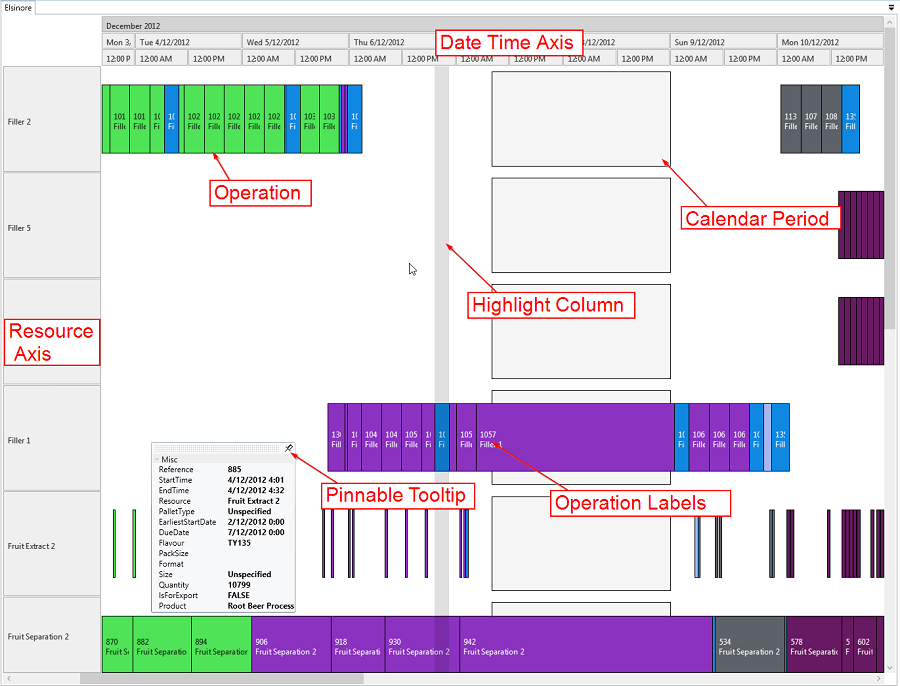

Rantt is divided into several sections:

- Main Toolbar
	- File Menu
	- Tools
	- Settings
- Gantt Chart
- Workspace Manageement
- Legend Control
- Calendar Control

Gantt Chart:
 - DateTime Axis
 - Resource Axis
 - Operation
 - Calendar period
 - Highlight column
 - Pinnable Tooltips
 
 