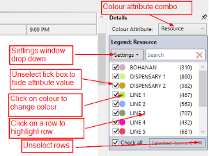
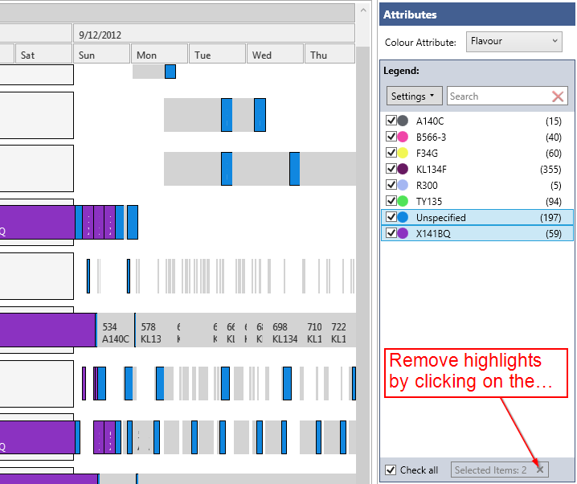
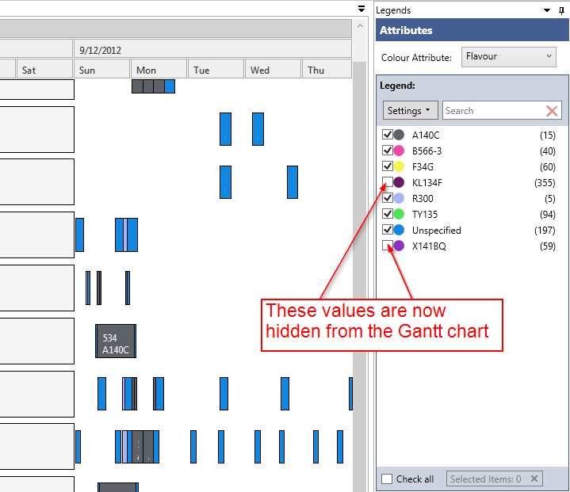
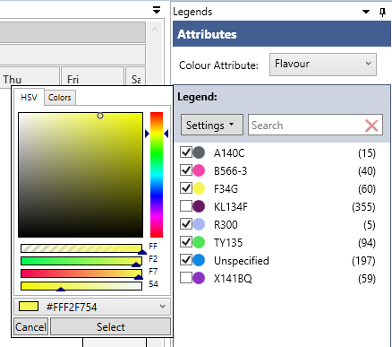

The legend control allows you to quickly identify operations on the Gantt chart by their associated attribute value.

All the field names from the operations data source will be available in the "Colour Attribute" combo box.

Once you select an attribute, each distinct value associated with it will be shown in the list box beneath it and will be associated with a distinct colour. 

Selecting a row will "highlight" these values on the Gantt chart and gray out all others.

**Note:** 

> - Select one or multiple rows by holding the "Ctrl" or "Shift" key down as you make your selection.
> - Clicking on the "x" button on the bottom right corner will reset the legend control.
> - The number (or count) of each operation having the specified value is shown in brackets on the right hand side.

With this tool you can also:

- Hide rectangles with a give attribute value by un-ticking the tick box. (Compare the image below with the images above.) 
	
- Change the color of an attribute by double clicking on a color disk.
	
- Search for attribute values using the search box (The search box will accept wild cards, and the "Settings" drop down window will allow you to select "Regex" for more advanced searches.)
