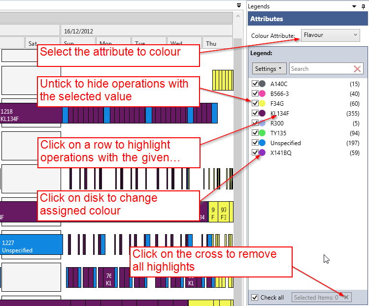

The legend control allows you to quickly identify operations on the Gantt chart by their associated attribute value.

All the column headers from your csv file or database table will be available in the "Colour Attribute" combo box.

Once you select an attribute, each distinct value associated with it will be shown in the list box beneath it and will be associated with a distinct colour. 

The number (or count) of each value is shown in brackets on the right hand side.

You can select one or multiple rows by holding the "Ctrl" or "Shift" key down as you make your selection.

Selecting a row will "highlight" these values on the Gantt chart and gray out all others.

Clicking on the "x" button on the bottom right corner will reset the legend control.

With this tool you can also:

- Change the color of an attribute by double clicking on a color circle. (TODO: add picture)
- Hide rectangles with a give attribute value by un-ticking the tick box. (TODO: add picture)
- Search for attribute values using the search box (The search box will accept wild cards, and the "Settings" drop down window will allow you to select "Regex" for more advanced searches.)

You can hide the legend control by clickon on the "pin" icon in the top right corner, in order to give you more room for the Gantt chart.