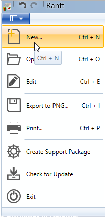
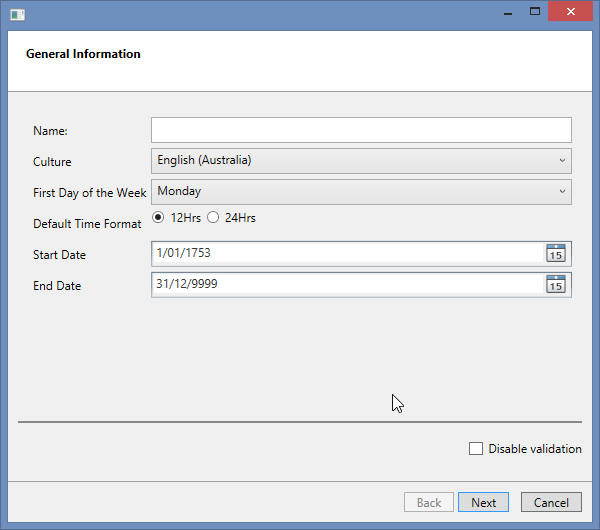
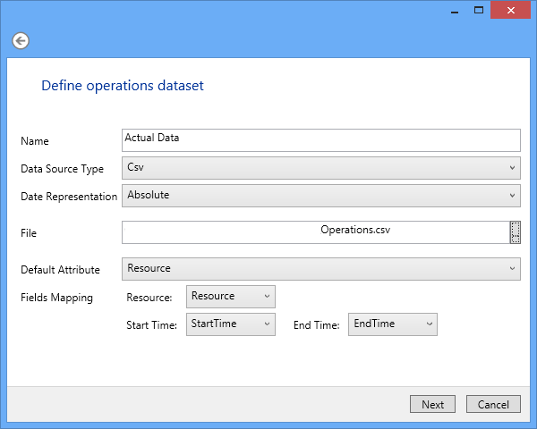
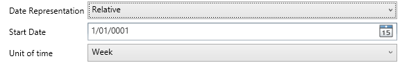
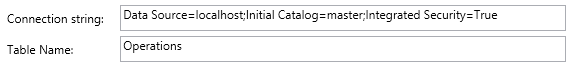
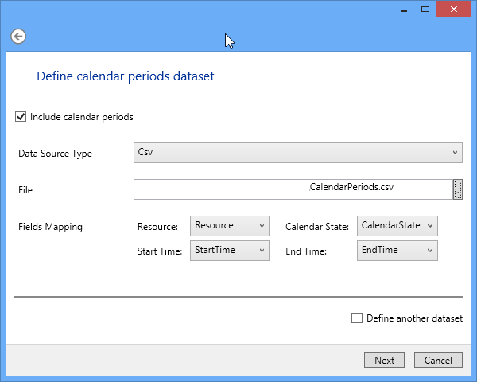
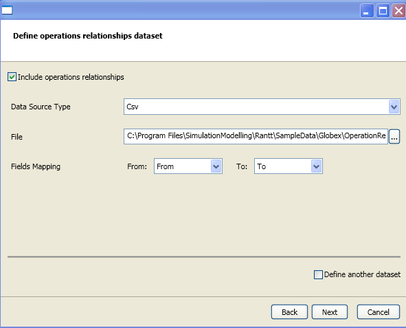
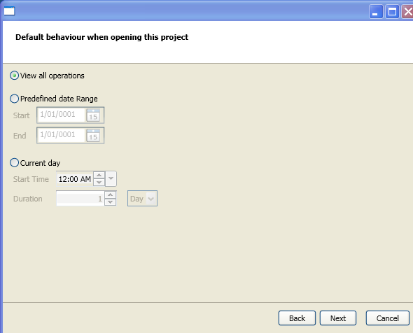
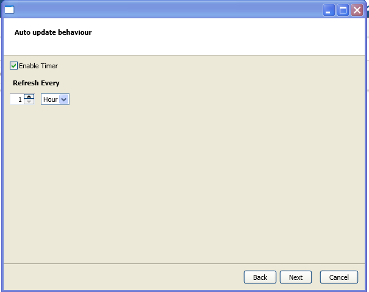

Introduction
============

In order to use the Rantt application (both desktop and web versions), you will need to first create a project file (.rprj file).

The Rantt Project Creator is a small utility wizard that will help you set up a project file easily.

**Note:**

> A .rprj file is simply an xml file which can be constructed manually, however the wizard provides a simple user interface to facilitate this task.

You can create a new project from the file menu:

Project File Structure
======================

The project file contains information about the data you want to import into Rantt.

A project file can contain multiple datasets.

A dataset is made up of:

- An operation data source (compulsory)
- A Calendar data source (optional)
- An Operations Relationship data source (optional)

These data sources can either be a csv file, an Excel spreadsheet or a database table (or view).

A project can contain multiple datasets, which makes it easier to compare data.

Creating A Project
==================

General Information
-------------------

The first screen is the general information.

This screen contains the following fields:

1. Name: The project name
1. Culture: Select your countries culture
1. First day of the week: Select the first day of the week
1. Default Time Format: Either 12 Hrs or 24 Hrs format
1. Start Date - Optional
1. End Date - Optional
    
**Note:**

> **Large database tables**
> 
> The Start and End dates are generally used to filter the data coming from large database tables. Only the data contained within this date range will be retrieved.

The disable validation checkbox at the bottom right corner of the screen should be left unticked.
Only enable this option if the wizard does not allow you save your project because of validation issues.

Operation Dataset
-----------------

The inputs required for this screen include:

1.  Name – The dataset name which will be used in the Gantt chart if multiple datasets are defined.
2.  Data Source type – Can either be:
    1.  CSV (file)
    2.  DB (table)
    3.  XML (Not implemented yet)
    4.  Json (Not implemented yet)

3.  Date Representation – Can either be:
    1.  Absolute: For fixed start and end times
    2.  Relative: For start and end times that are defined in terms of numbers (either integers or floats). If this option is selected a "Start Date" field will appear, from which the relative time will start, as well as a "Unit of time" field, which corresponds to the unit of time used in the start and end time fields. 
        Relative time is generally used for simulation data.
        

4.  File – The location and name of the operation file. If a database source is selected instead of a CSV file, you will be prompted for a connection string and database table name:
    
    The "Table Name" can either be physical database table or a view.
5.  Default Attribute – This field is not critical. Generally the attribute that is the most significant to the user should be set as default.
6.  Field Mappings – The wizard will try and automatically match the column or fields names to the required attributes. If it is unsuccessful the user will need to map the attributes manually.
    1.  Resource
    2.  Start Time
    3.  End TIme

The wizard will validate the data source. If successful the next screen will capture calendar information.

If the validation fails the wizard will prompt you to fix the relevant input fields.

Calendar Information
--------------------

Calendar information is optional, therefore in order to include such information please tick the "Include calendar periods" option.

There is an option at the bottom of the screen to include another dataset. Please tick this option in order to create multiple datasets.

The next screen will prompt for the optional "Operation Relationships" file.

 

Operation Relationships Information
-----------------------------------

Operation relationship information is optional, therefore in order to include such information please tick the "Include operation relationships" option.

You can define the file name and other details as shown below.

 

There is an option at the bottom of the screen to include another dataset. Please tick this option in order to create multiple datasets.

 

Viewing Operations
------------------

 

The default view for the operations like, "all the operations" or a range based on dates can be set in the next screen.

 

Refresh Data
------------

The timer for refreshing the data can be set in the next screen. You need to check the "Enable Timer" check box to get this to effect.

 

Summary
-------
This screen will provide a summary of the project name as well as the datasets that have been defined.

 

You will only be able to save the project if all the required fields have been filled in and the data was successfully validated.