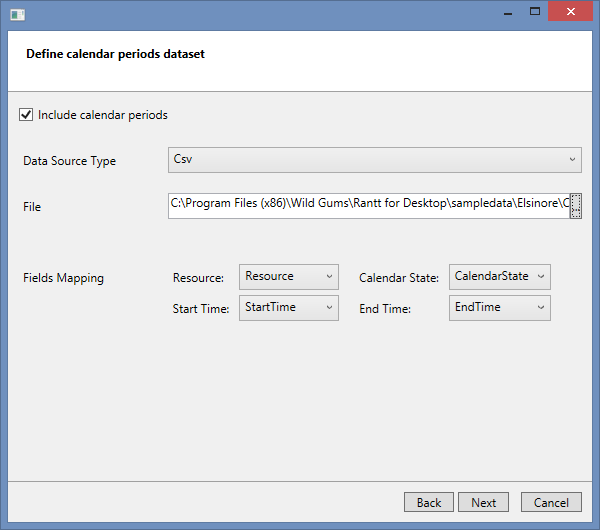
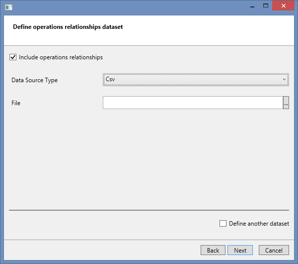
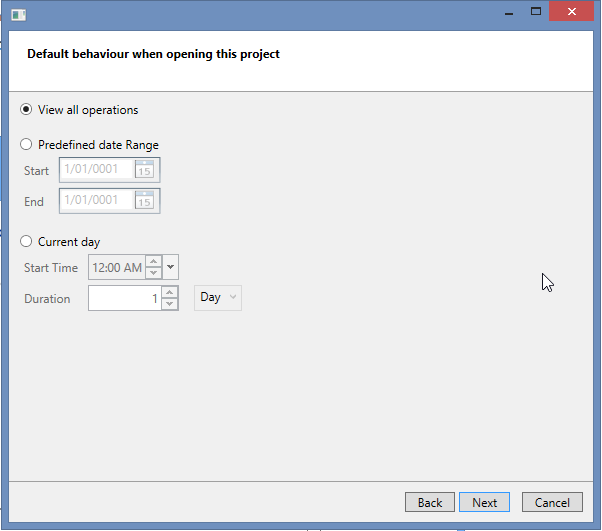
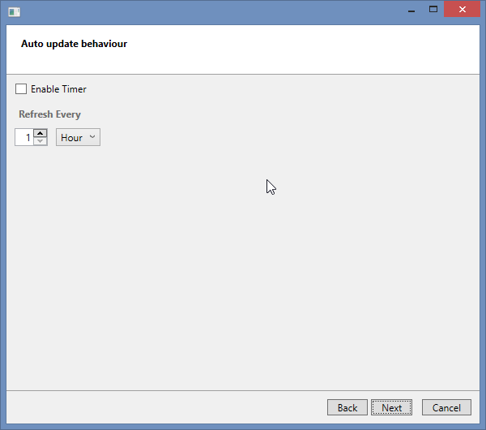
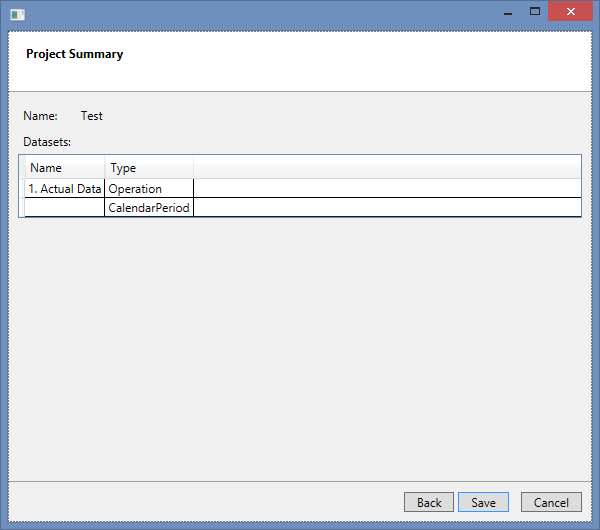

Introduction
============

In order to use the Rantt application (both desktop and web versions), you will need to first create a project file (.rprj file).

The Rantt Project Creator is a small utility wizard that will help you set up a project file easily.

**Note:**

> A **.rprj** file is simply an xml file which can be constructed manually, however the wizard provides a simple user interface to facilitate this task.

You can create a new project from the file menu:

Project File Structure
======================

The project file contains information about the data you want to import into Rantt.

A project file can contain multiple datasets.

A dataset is made up of:

- An operation data source **(compulsory)**
- A Calendar data source **(optional)**
- An Operations Relationship data source **(optional)**

These data sources can either be a csv file, an Excel spreadsheet or a database table (or view).

**Note:**

> It is possible to have an operation csv file, a calendar database table and a relationship Excel spreadsheet all in the one dataset.

A project can contain multiple datasets, which makes it easier to compare data, as multiple datasets can be displayed in Rantt at the same time. (See the "ActualPlanned" example on the [sample data page](http://www.resourcegantt.com/documentation/sampledata/).)

Creating A Project
==================

General Information
-------------------

The first screen is the general information.

This screen contains the following fields:

1. Name: The project name
1. Culture: Select your countries culture
1. First day of the week: Select the first day of the week
1. Default Time Format: Either 12 Hrs or 24 Hrs format
1. Start Date - Optional
1. End Date - Optional
    
**Note:**

> **Large database tables**
> 
> The Start and End dates are generally used to filter the data coming from large database tables. Only the data contained within this date range will be retrieved.

The disable validation checkbox at the bottom right corner of the screen should be left unticked.
Only enable this option if the wizard does not allow you save your project because of validation issues. i.e. by disabling validation will allow you to save your project despite validation issues.

Operation Dataset
-----------------

The inputs required for this screen include:

1.  Name: The dataset name which will be used in the Gantt chart if multiple datasets are defined.
1.  Data Source type: Can either be:
    1. a CSV (file)
	1. an Excel Spreadsheet
    1. a Database table (or view)
1.  Date Representation: Can either be:
    1.  Absolute: For fixed start and end times (which is the most frequently used option)
    1.  Relative: For start and end times that are defined in terms of numbers (either integers or floats). If this option is selected a "Start Date" field will appear, from which the relative time will start, as well as a "Unit of time" field, which corresponds to the unit of time used in the start and end time fields. 
        
        
        
        **Note:**
        
		> Relative time is generally used for simulation data that starts from time "0".
1.  File: The location and name of the operation file. 

	If a database source is selected you will be prompted for a connection string and database table name:
    
	
    The "Table Name" can either be a physical database table or a view.
1.  Default Attribute: Select the attribute that is the most significant for you.
1.  Field Mappings: The wizard will try and automatically match the column or fields names to the required attributes. If it is unsuccessful you will have to map the attributes manually.
    1.  Resource
    1.  Start Time
    1.  End TIme

The wizard will validate the data source. If successful you will be able to proceed to the next screen.

If the validation fails the wizard will prompt you to fix the relevant input fields.

Calendar Period Dataset
-------------------------

Calendar information is optional.

Relationship Dataset
---------------------

Operation relationship information is optional.

You can define the file name and other details as shown below.

There is an option in the bottom right corner of the screen to include another dataset. 
Please tick this option in order to create multiple datasets.

If you select this option you will be able to choose another operation, calendar period or relationship dataset.

Once you have finished defining all your datasets click on the "Next" button.
 

View Window
------------------

You can select the size of the view window when starting Rantt.

The options are:

- View all operations: The view window will be set in order to display all operations
- Predefined date Range: Open Rantt to focus a date range of your choosing
- Current day: The view window will start from the start time defined for today and will have a predefined duration.

Rantt will always open the project with the specified view window, however you can change the view window manually by zooming and panning.

Auto Updates
------------

Rantt can be configured to refresh your data at set intervals of time.
Click on "Enable Timer" and then choose how often you want your data to be refreshed.

**Note:**

> This features is uesful if you want to see what is happening on a factory shop floor in real time.

Summary
---------

This screen will provide a summary of the project name as well as the datasets that have been defined.

 
You will only be able to save the project if all the required fields have been filled in properly and the data was successfully validated.

If there are validation issues, warning messages will be displayed at the top of the screen to inform you about the problem and how to fix it.
Use the "Back" button to navigate to the page that has issues. Once they are fixed click on the "Next" button to get back to the summary page.
If there are no longer any issues you will be able to save the project.