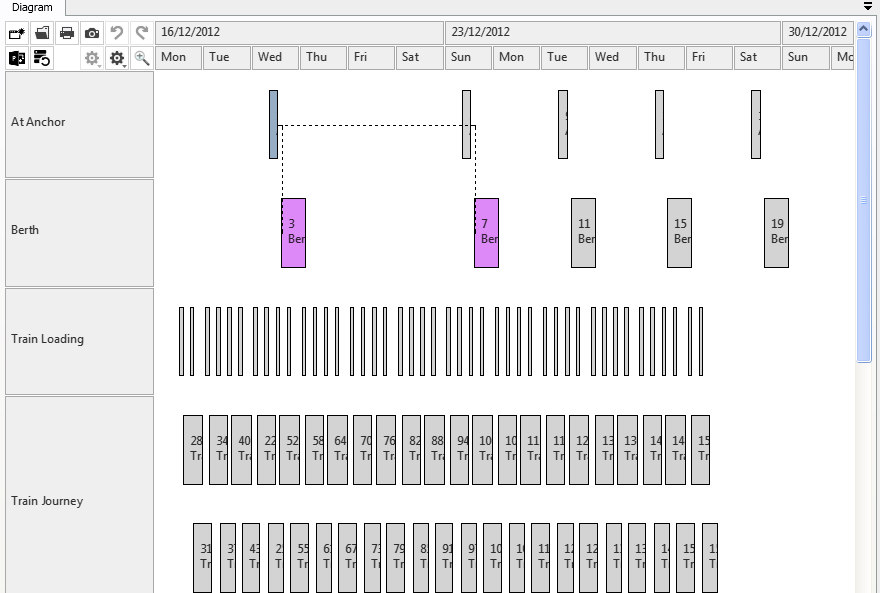
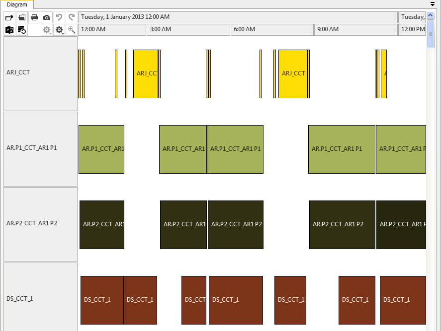

Introduction
============

Rantt comes with some sample projects, which can be found in `**C:\Program Files (x86)\Wild Gums\Rantt for Desktop\sampledata**`.

The sample projects are:

- ActualPlanned
- Elsinore
- Finoflex
- Globex
- LargeScheduleHorizon
- MultiDataset
- Port
- TransArcticRail
- xlsElsinore: Same project as Elsinore but the data is in an Excel spreadsheet
- xlsFinoflex: Same project as Finoflex but the data is in an Excel spreadsheet

ActualPlanned
=============

- Displays two datasets side by side (i.e there are two separate operation files)
- Compare various scheduled
- Compare schedule with actual shop floor perfromance

Elsinore
========

- Beverage demo
- Operations and calendar periods
- Multi line labels

Finoflex
========

- Pharmaceutical demo
- Uses extensive calendar periods
- If a SetupStartTime or TearDownTime column are specified, Rantt will draw the setup and tear down periods as small black rectangles
- Resources with multiple concurrent operations

Globex
======

- Display operations and their relationships

 

TransArcticRail
===============

- Simulation demo
- Relative start and end times
- Large dataset with over 30 000 operations

 

Multiple Datasets
=================

- Displays 3 datasets side by side (Rantt can display up to 10 datasets side by side)
- Datasets can be hidden if required

