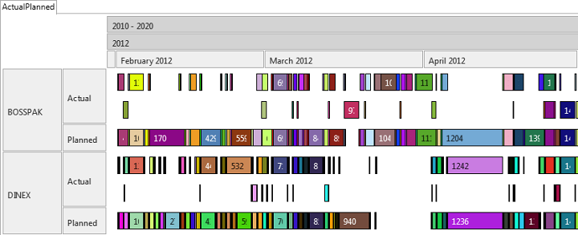
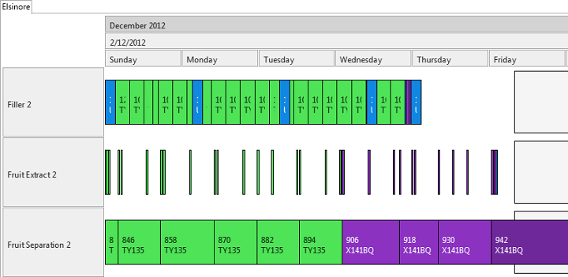
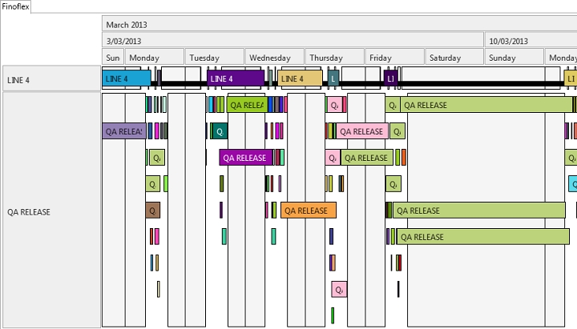
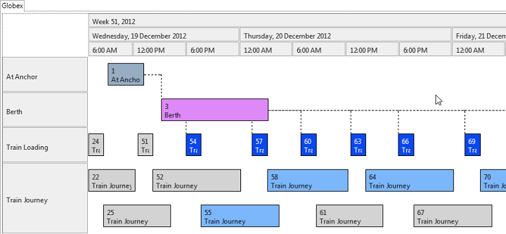
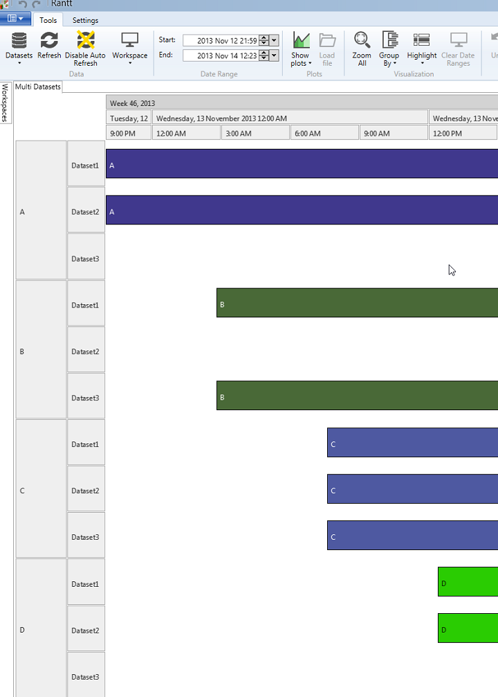
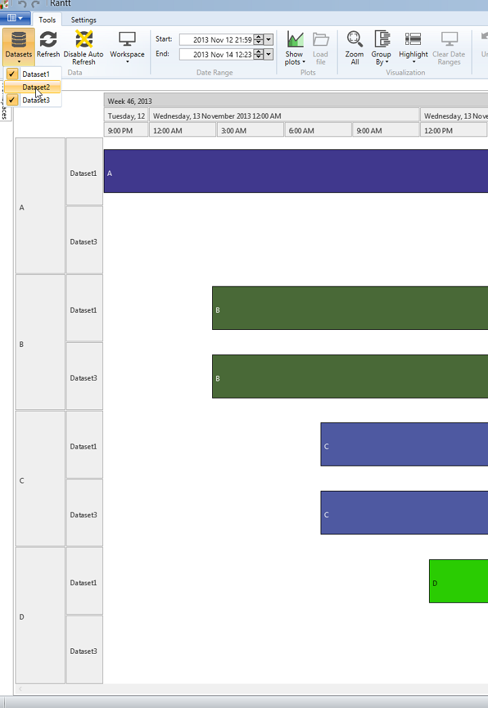
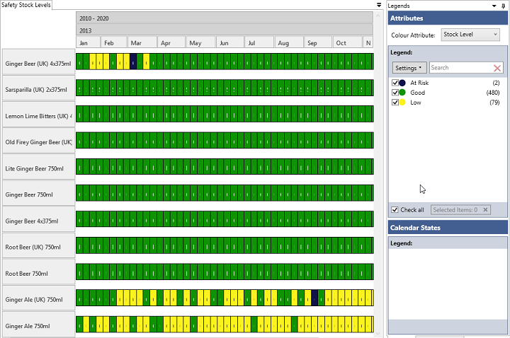
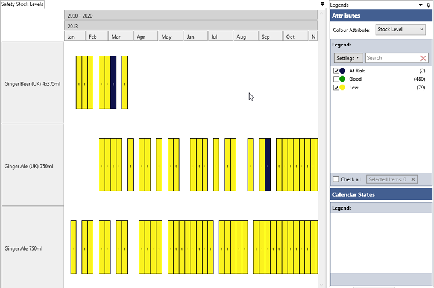
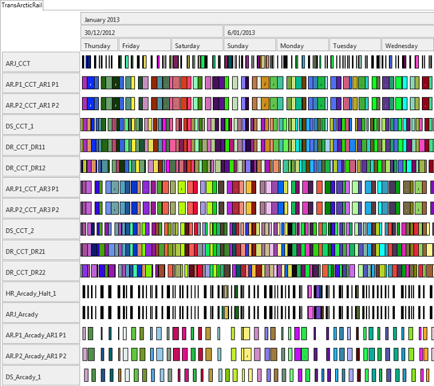

Introduction
============

Rantt comes with some sample projects, which can be found in:

 `C:\Program Files (x86)\Wild Gums\Rantt for Desktop\sampledata`.

The sample projects are:

- ActualPlanned
- Elsinore
- Finoflex
- Globex
- MultiDataset
- SafetyStock
- TransArcticRail
- xlsElsinore: Same project as Elsinore but the data is in an Excel spreadsheet
- xlsFinoflex: Same project as Finoflex but the data is in an Excel spreadsheet

ActualPlanned
=============

- Displays two datasets side by side (i.e there are two separate operation files)
- Compare various scheduled
- Compare schedule with actual shop floor perfromance

Elsinore
========

- Beverage demo
- Operations and calendar periods
- Multi line labels

Finoflex
========

- Pharmaceutical demo
- Uses extensive calendar periods
- If a SetupStartTime or TearDownTime column are specified, Rantt will draw the setup and tear down periods as small black rectangles
- Resources with multiple concurrent operations

Globex
======

- Port demo
- Display operations and their relationships

Multiple Datasets
=================

- Displays 3 datasets side by side (Rantt can display up to 10 datasets side by side)
- Datasets can be hidden if required

Safety Stocks
==============

- Display safety stock levels
- Display forecast inventory from ERP system
- Rantt can be used as an exception reporting system

- Hide operations and resources that are all green (To allow you to focus on what matters)

TransArcticRail
===============

- Rail newtork simulation demo
- Relative start and end times
- Large dataset with over 30 000 operations

