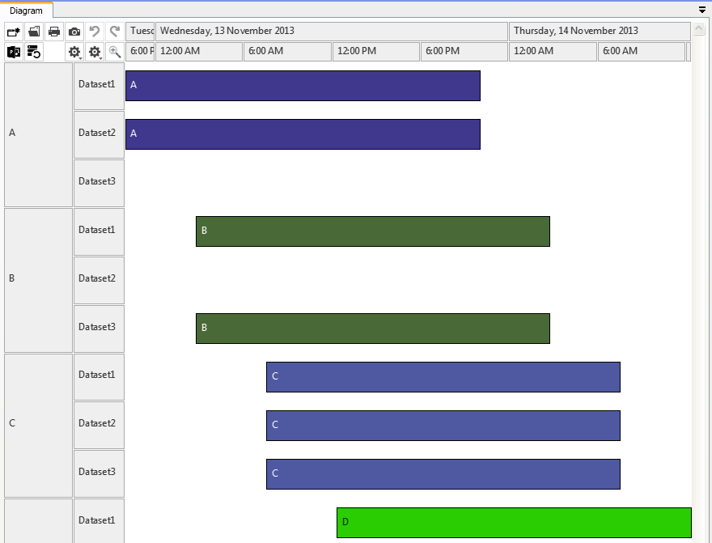

Introduction
============

Rantt comes with some sample projects, which can be found in `**C:\Program Files (x86)\Wild Gums\Rantt for Desktop\sampledata**`.

The sample projects are:

- ActualPlanned
- Elsinore
- Finoflex
- Globex
- LargeScheduleHorizon
- MultiDataset
- Port
- TransArcticRail
- xlsElsinore: Same project as Elsinore but the data is in an Excel spreadsheet
- xlsFinoflex: Same project as Finoflex but the data is in an Excel spreadsheet

ActualPlanned
=============

- Displays two datasets side by side (i.e there are two separate operation files)
- Compare various scheduled
- Compare schedule with actual shop floor perfromance

Elsinore
========

- Beverage demo
- Operations and calendar periods

Finoflex
========

- Pharmaceutical demo
- Uses extensive calendar periods
- If a SetupStartTime or TearDownTime column are specified, Rantt will draw the setup and tear down periods as small black rectangles
- Resources with multiple concurrent operations

Globex
======

This sample project has the operations and operation relationships data. The child and parent relationships (as dotted lines) can be seen as shown in the screen shot.

 

TransArcticRail
===============

 

This project shows the time table of trains in the TransArctic segment. This project requires only the operations file.

 

 

Multiple Datasets
=================

 

This project has three operations file and has set up as three different datasets. When creating the project, you should select "define another dataset" after selecting the first operations file.

The below screen shot shows three different data sets against same resources.

 

 

