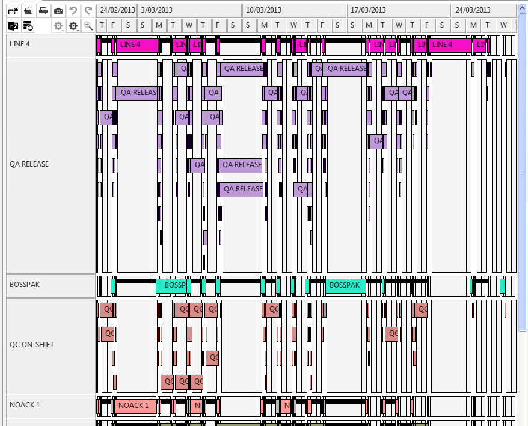
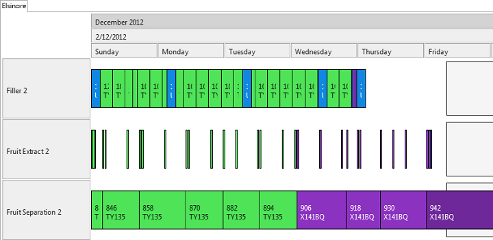
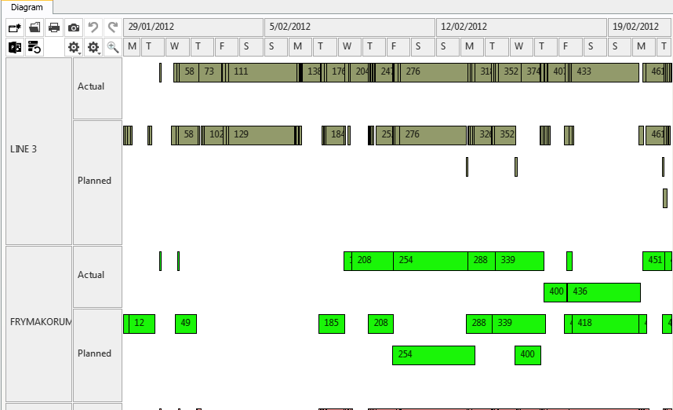

Introduction
============

The following page will give you a short introduction of the sample projects that come with Rantt. 

You can find these samples in the following folder:

    C:\Program Files\SimulationModelling\Rantt\SampleData

Finoflex
========

This sample project has been built with sample data for finoflex. You can the operations lined against the resource along with calendar periods. The visible are zero and 100 % efficiency calender periods. 

 
 

Elsinore
========

 

This sample project has both operations and calendar data. The calendar perios that are visible are off-shift and at-risk. The same can be seen in the calendar legend control as well.

 

 

Globex
======

 

This sample project has the operations and operation relationships data. The child and parent relationships (as dotted lines) can be seen as shown in the screen shot.

 

TransArcticRail
===============

 

This project shows the time table of trains in the TransArctic segment. This project requires only the operations file.

 

 

Multiple Datasets
=================

 

This project has three operations file and has set up as three different datasets. When creating the project, you should select "define another dataset" after selecting the first operations file.

The below screen shot shows three different data sets against same resources.

 

 

ActualPlanned
=============

 

This project is a practical example for multiple datasets. You can view actual against planned. There are two files giving details of actual operations and planned operations.

 

 
