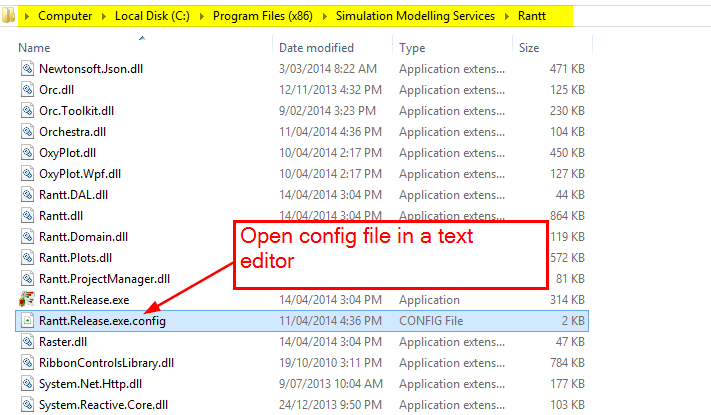
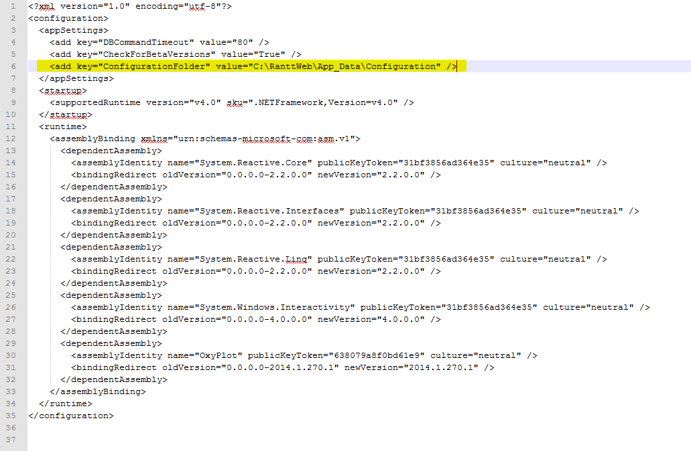

The web and desktop version of Rantt can share workspaces if both applications point to the same folder the workspaces are saved in.

Because of permission issues with IIS it is often easier to change the desktop configuration.

Open the **Rant.Release.exe.config** file located in "**C:\Program Files (x86)\Wild Gums\Rantt for Desktop**"

Then add the line:

    <add key="ConfigurationFolder" value="C:\RanttWeb\App_Data\Configuration" />

**Note:**

> You may have to change the "C:\RanttWeb" to match the correct folder on your server.

 

 

 
                    