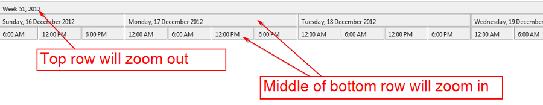

Shortcuts
============

**Note:**

> In order for the shortcut keys to work you need to make sure the Gantt tab has focus.
 
Keys                     | Mouse pointer location     | Description                                               | Affects
-------------------------|----------------------------|-----------------------------------------------------------|--------
Esc                      |NA                          |Zoom out to maximum                                        |Interval Grid, DateTimeAxis, ResourceAxis
Ctrl + Mouse Wheel       |Interval Grid               |Zoom in and out                                            |IntervalGrid, ResourceAxis, DateTimeAxis
Ctrl + Mouse Wheel       |DateTimeAxis                |Zoom in and out                                            |DateTimeAxis
Ctrl + Mouse Wheel       |ResourceAxis                |Zoom in and out                                            |ResourceAxis
Mouse Wheel              |ResourceAxis, IntervalGrid  |Scroll vertically                                          |ResourceAxis, IntervalGrid
Mouse Wheel              |DateTimeAxis                |Scroll Horizontally                                        |DateTimeAxis, IntervalGrid
Home                     |NA                          |Move to the Horizon StartTime                              |DateTimeAxis, IntervalGrid
End                      |NA                          |Move to the Horizon EndTime                                |DateTimeAxis, IntervalGrid
Ctrl + \[h,d,w,m,y\]     |NA                          |Set viewport to hour, day, week, month, or year            |DateTimeAxis, IntervalGrid
Shift + \[h,d,w,m,y\]    |NA                          |Set the "step size" to hour, day, week, month or year      |DateTimeAxis, IntervalGrid
Right Arrow (->)         |NA                          |Move the viewport to the right by the "step size" duration |DateTimeAxis, IntervalGrid
Left Arrow (->)          |NA                          |Move the viewport to the left by the "step size" duration  |DateTimeAxis, IntervalGrid
Shift + Right Arrow (->) |NA                          |Add "step size" to the viewport. Left side is fixed        |DateTimeAxis, IntervalGrid
Shift + Left Arrow (<-)  |NA                          |Substract "step size" to the viewport. Left side is fixed  |DateTimeAxis, IntervalGrid
Ctrl + Right Arrow (->)  |NA                          |Add "step size" to the viewport. Right side is fixed       |DateTimeAxis, IntervalGrid
Ctrl + Left Arrow (<-)   |NA                          |Substract "step size" to the viewport. Right side is fixed |DateTimeAxis, IntervalGrid
Ctrl + R                 |NA                          |Zoom out to maximum on the ResourceAxis only               |ResourceAxis, IntervalGrid

Navigation
==========

Clicking on rectangles on the Date Time Axis will allow you to zoom in or out of the specified time range.

- The top row rectangle will zoom out
- The middle and bottom row rectangles will zoom in

