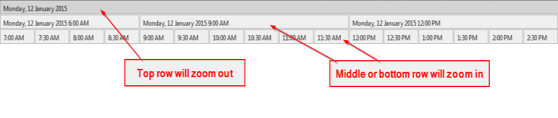

Shortcuts
============

**Note:**

> In order for the shortcut keys to work you need to make sure the Gantt tab has focus.

<h2>Mouse</h2>
<table class="table hover">
    <thead>
        <tr>
            <th>Mouse pointer location</th>
            <th>Description</th>
            <th>Affects</th>
        </tr>
    </thead>
    <tbody>
        <tr>
        	<td><strong>Ctrl + Mouse Wheel</strong></td>
        	<td/>
        	<td/>
        </tr>
        <tr>
            <td>Interval Grid</td>
            <td>Zoom in and out</td>
            <td>IntervalGrid, ResourceAxis, DateTimeAxis</td>
        </tr>
        <tr>
            <td>DateTimeAxis</td>
            <td> Zoom in and out</td>
            <td>DateTimeAxis</td>
        </tr>
        <tr>
            <td>ResourceAxis</td>
            <td>Zoom in and out</td>
            <td>ResourceAxis</td>
        </tr>
        <tr>
        	<td><strong>Mouse Wheel</strong></td>
        	<td/>
        	<td/>
        </tr>
        <tr>
            <td>ResourceAxis, IntervalGrid</td>
            <td>Scroll vertically</td>
            <td>ResourceAxis, IntervalGrid</td>
        </tr>
        <tr>
            <td>DateTimeAxis</td>
            <td>Scroll Horizontally</td>
            <td>DateTimeAxis, IntervalGrid</td>
        </tr>
    </tbody>
</table>
<h2>Keyboard</h2>
<table class="table hover">
    <thead>
        <tr>
            <th>Keys</th>
            <th>Description</th>
            <th>Affects</th>
        </tr>
    </thead>
    <tbody>
        <tr>
            <td>Esc</td>
            <td>Zoom out to maximum</td>
            <td>Interval Grid, DateTimeAxis, ResourceAxis</td>
        </tr>
        <tr>
            <td>Home</td>
            <td>Move to the Horizon StartTime</td>
            <td>DateTimeAxis, IntervalGrid</td>
        </tr>
        <tr>
            <td>End</td>
            <td>Move to the Horizon EndTime</td>
            <td>DateTimeAxis, IntervalGrid</td>
        </tr>
        <tr>
            <td>Ctrl + [h,d,w,m,y]</td>
            <td>Set viewport to hour, day, week, month, or year</td>
            <td>DateTimeAxis, IntervalGrid</td>
        </tr>
        <tr>
            <td>Shift + [h,d,w,m,y]</td>
            <td>Set the "step size" to hour, day, week, month or year</td>
            <td>DateTimeAxis, IntervalGrid</td>
        </tr>
        <tr>
            <td>Right Arrow (→)</td>
            <td>Move the viewport to the right by the "step size" duration</td>
            <td>DateTimeAxis, IntervalGrid</td>
        </tr>
        <tr>
            <td>Left Arrow (←)</td>
            <td>Move the viewport to the left by the "step size" duration</td>
            <td>DateTimeAxis, IntervalGrid</td>
        </tr>
        <tr>
            <td>Shift + Right Arrow (→)</td>
            <td>Add "step size" to the viewport. Left side is fixed</td>
            <td>DateTimeAxis, IntervalGrid</td>
        </tr>
        <tr>
            <td>Shift + Left Arrow (←)</td>
            <td>Substract "step size" to the viewport. Left side is fixed</td>
            <td>DateTimeAxis, IntervalGrid</td>
        </tr>
        <tr>
            <td>Ctrl + Right Arrow (→)</td>
            <td>Add "step size" to the viewport. Right side is fixed</td>
            <td>DateTimeAxis, IntervalGrid</td>
        </tr>
        <tr>
            <td>Ctrl + Left Arrow (←)</td>
            <td>Substract "step size" to the viewport. Right side is fixed</td>
            <td>DateTimeAxis, IntervalGrid</td>
        </tr>
        <tr>
            <td>Ctrl + R</td>
            <td>Zoom out to maximum on the ResourceAxis only</td>
            <td>ResourceAxis, IntervalGrid</td>
        </tr>
    </tbody>
</table>

Navigation
==========

Clicking on rectangles on the Date Time Axis will allow you to zoom in or out of the specified time range.

- The top row rectangle will zoom out
- The middle and bottom row rectangles will zoom in

