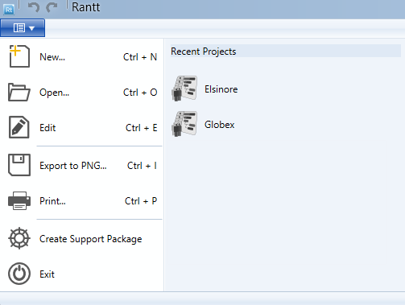

### New (Ctrl + N)

Create a new Rantt project file.

### Open (ctrl + O)

Open a Rantt project and display the data in the Gantt chart.

### Edit (Ctrl + E)

Edit an existing Rantt project file.

### Export to PNG (Ctrl + I)

Save the Gantt chart to a PNG file.

### Print (Ctrl + P)

Print the Gantt chart.

### Create Support Package

Will create a support package, which will contain all the data displayed in the Gantt chart. This will allow us to reproduce any errors you may come across, and fix them faster for you.

### Exit

Close Rantt.

### Recent Projects

Recent projects will be listed in this section. Simply click on the project name to open it up.

**Note:**

> A lot of commands have [shortcut keys](http://www.resourcegantt.com/documentation/shortcuts/)