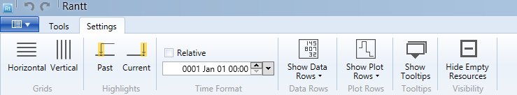
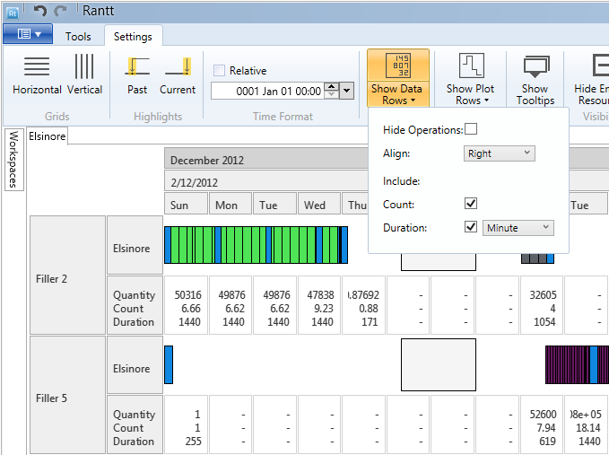
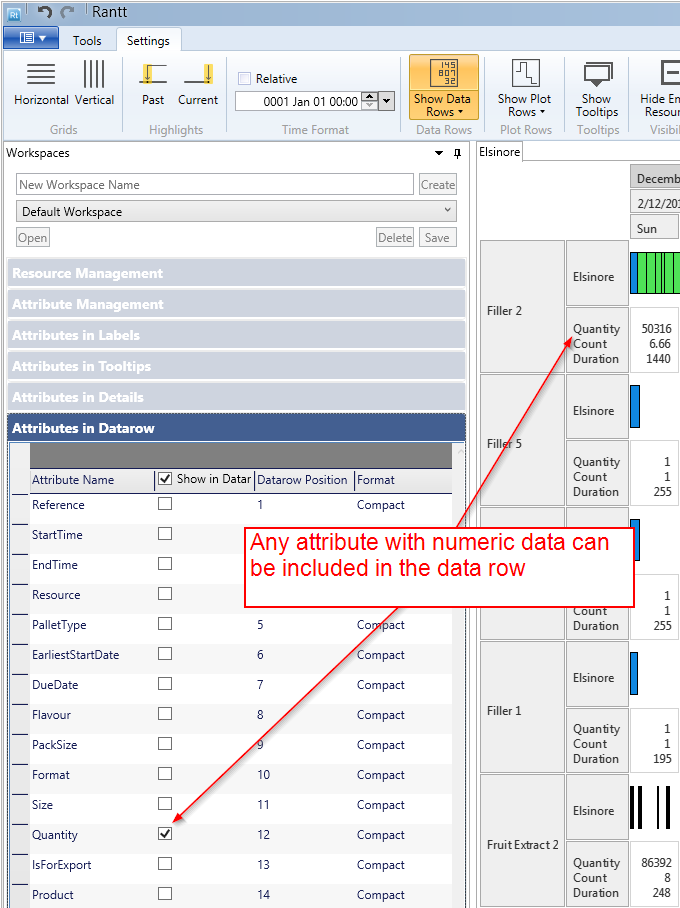
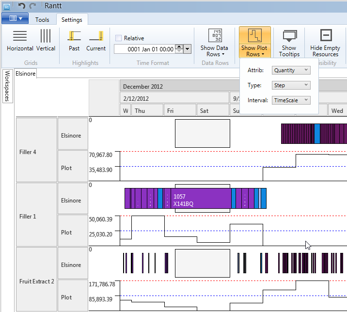
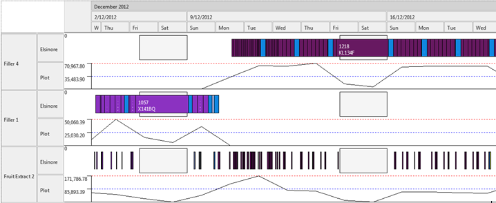

Here is a description of the buttons as seen in the toolbar from left to right:

### Horizontal Lines

Display horizontal lines between the resources.

### Vertical Lines

Display vertical lines between the time intervals as defined by the date-time axis.

### Past Highlight

Highlight the past region.

This feature is useful to disinguish past operations from future ones.

### Current DateTime Line

Show the current time, which is displayed as a vertical dash line. It will only be seen if the view window contains the current date time.

### Time Format

If the operations data comes from a simulation model that uses "0" as the beginning of time you can select relative time and set a new date origin.

### Data Rows

With data rows enabled you will see a new row for each resource which will give you some statistical information about the operations contained within a time interval.

The data row has a few options:

- Hide operations: will hide all the operations and only the data rows will be shown
- Align: The numbers can either be left or right aligned
- Include Count: will display the number of operations contained within a time interval (or part thereof)
- Include Duration: will display the total duration of all operations contained within a time interval (or part thereof)

**Note:**

> Any attributes can be included in the data row cells if they contain numeric values

### Plot Rows

The plot row has a few options:

- Attrib: Select the attribute you want to see in the plot. The attribute must be a numeric type.
- Type: The plot can either "step" or "line"
- Interval: can either be by time scale (as set by the date time axis) or by operation duration.

**Note:**

> If the Interval is equal to "time scale" the plots will use the same data values that are used in the data rows for the selected attribute.

Example of a line plot:

### Tooltips

Enable of disbale tooltips.

### Hide Empty Resource

When enabled Rantt will hide resources that have empty resources. (i.e. a resource that has no operations on it)
