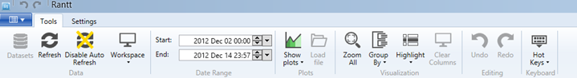

# Toolbar Tools

Here is a description of the buttons as seen in the toolbar from left to right:

### Datasets

### Refresh

### Disable Auto Refresh

### Workspaces

### Start and End Dates (Date Range)

### Show Plots

Options: Load file

### Zoom All

### Group By

Change the attribute used for grouping on the resource axis

### Highlight

### Clear Columns

Remove all column highlights from the Gantt chart.

### Undo

### Redo

### Hot Keys

Options:
