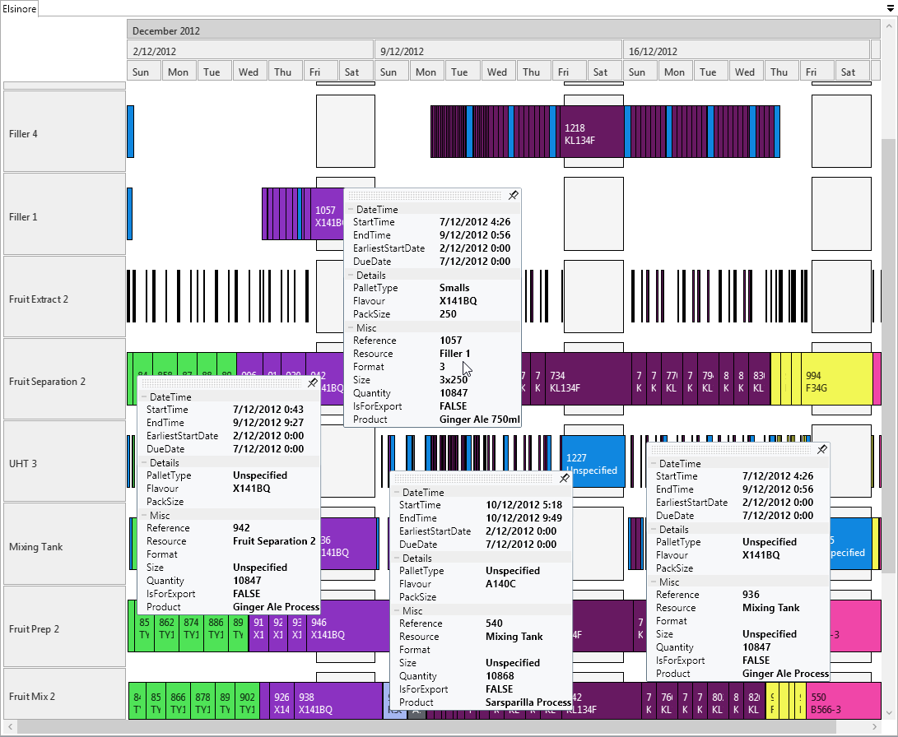
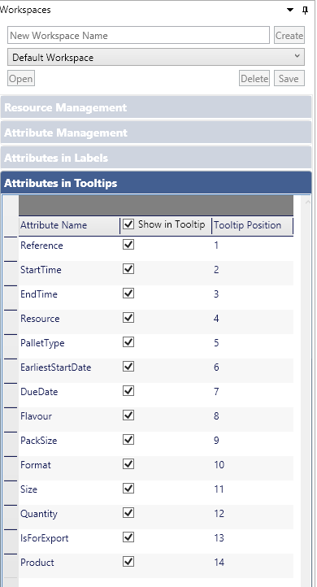
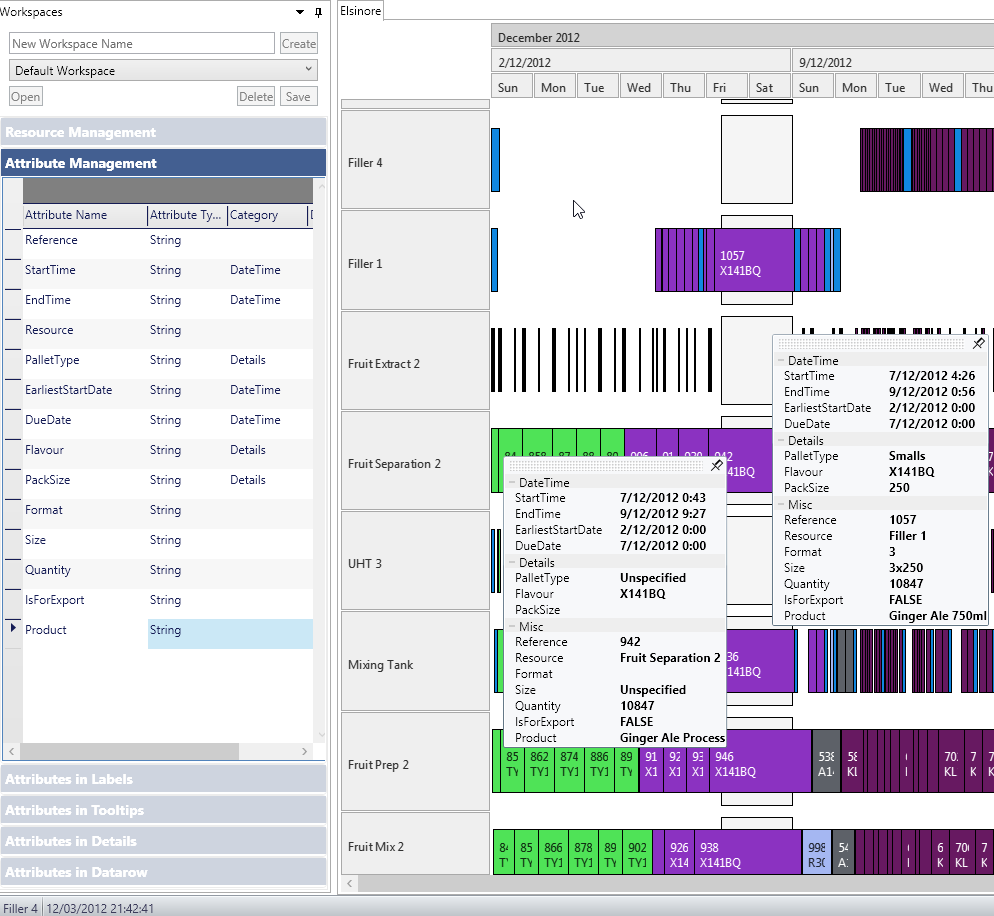
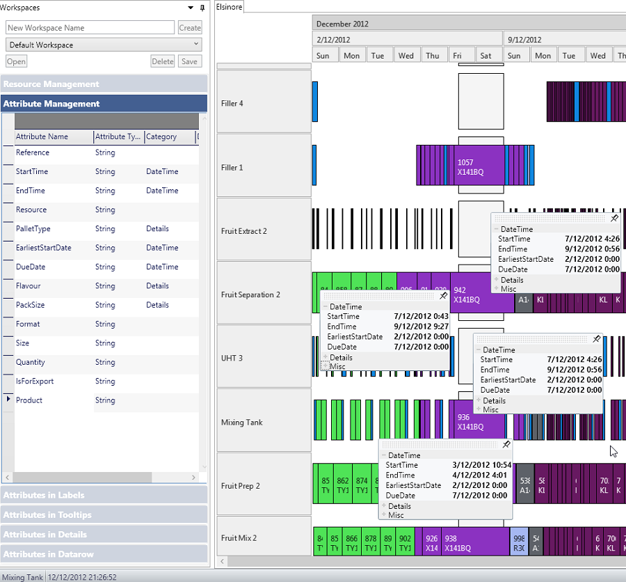
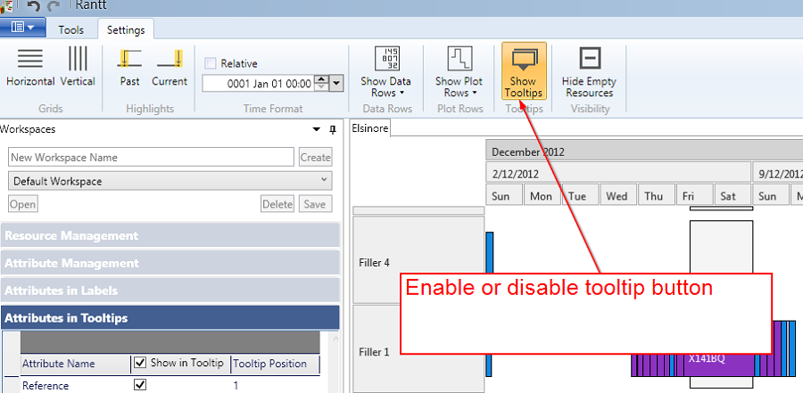

Tooltips in Rantt are very powerful and customisable. The main highlights are:

- Pinnable tootlips, so more than one tooltip can be displayed at the same time making it easy to compare values from different operations
	
	
- Tooltips have a "grip header" which allows you to click on their header to move them around the screen
- The position of fields on the tooltips can be changed
- You can choose which fields to include or exclude

	

- Fields can be grouped into categories
	
	
	- Create as many categories as you like by editing the "Category" column in the "Attribute Management" grid.
	**Note:** by default all fields belong to the "Misc" category if nothing is specified.
	
- Categories can be expanded or collapsed so you can concentrate on the information that is important to you
	
	
- Tooltips can be enabled or disabled
	

