Troubleshooting guides to get IIS setup properly.
-------------------------------------------------

Minimum requirements
=====================

Operating System: Window Vista or later, and has been tested on Windows 7, Windows 8, Windows 8.1 Preview and Windows Server 2012

.Net framework: Rantt Web Host requires a minimum of .Net version 4.5

Web Server: Rantt Web Host requires Internet Information Server (IIS) webserver option to be installed, setup to use ASP.Net and the .Net 4.0 Application Pool with Integrated Pipeline.
Note: If IIS cannot use port 80, the default web server port, because the port is already in use, then consider [Setting up an alternate port for IIS](#setting-up-an-alternate-port-for-iis).

Win 7 - IIS 7.5
---------------
By default Windows 7 does not have ASP.Net installed; this can result in the error "[HTTP Error 500.19 - Internal Server Error](
#http-error-50019---internal-server-error), The requested page cannot be accessed because the related confirmation data for the page is invalid."

If ASP.Net is set to .Net version 2.0 instead of ver. 4.0, this will result in "[HTTP Error 500.21 - Internal Server Error](#http-error-50021---internal-server-error), Handler "ExtensionlessUrlHandler-Integrated-4.0" has a bad module "ManagedPipelineHandler" in its module list."

Win 8 - IIS 7.5
---------------

Here are some links that will be useful to get the Webhost project running on IIS on Windows 8.

[http://stackoverflow.com/questions/12486089/iis8-win8-and-runallmanagedmodulesforallrequests-true](http://stackoverflow.com/questions/12486089/iis8-win8-and-runallmanagedmodulesforallrequests-true)

[http://proq.blogspot.com.au/2012/09/wcf-on-iis-and-windows-8.html](http://proq.blogspot.com.au/2012/09/wcf-on-iis-and-windows-8.html)

Click on Control Panel, Programs, Turn Windows Features On and Off, as below:

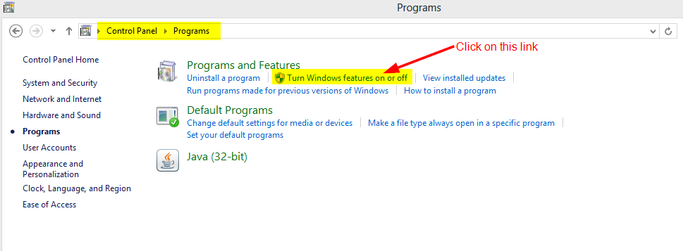 

Verify that you have added ASP.Net and turned on these features:

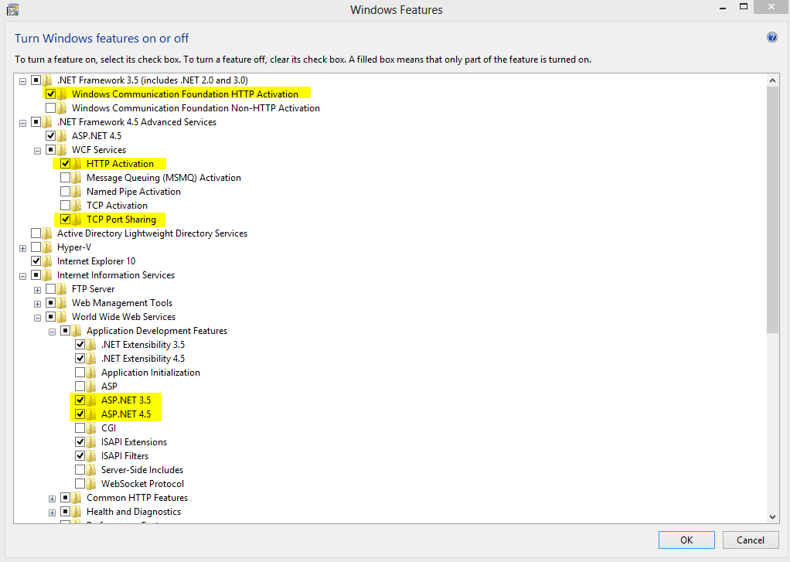 
 

Browser Error Messages
======================

Here are a list of various browser error messages with details of the respective solutions:

-   [HTTP Error 403.14 - Forbidden](#http-error-40314---forbidden)
-   [HTTP Error 404.0 - Not Found](#http-error-4040---not-found)
-   [HTTP Error 404.2 -  Not Found](#http-error-4042---not-found)
-   [HTTP Error 500.19 - Internal Server Error](#http-error-50019---internal-server-error)
-   [HTTP Error 500.21 - Internal Server Error](#http-error-50021---internal-server-error)

HTTP Error 403.14 - Forbidden
-----------------------------

This error appears in the web browser as you attempt to access the Rantt Web Host website:

**HTTP Error 403.14 - Forbidden.** 

The Web server is configured to not list the contents of this directory.

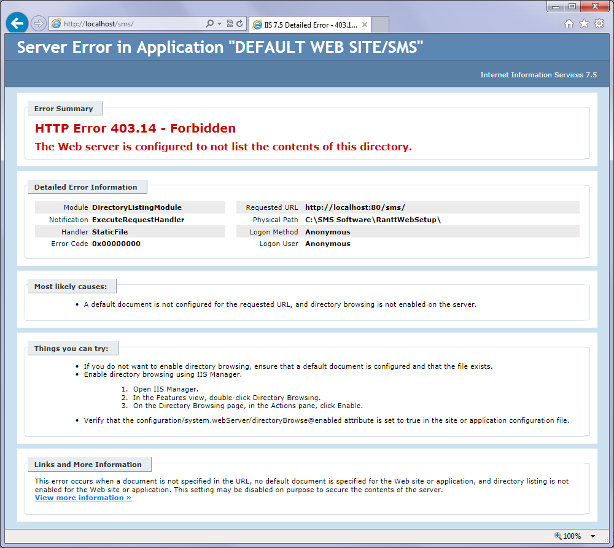 

The error message would seem to imply you need directory browsing turned on.

Instead the issue is related to either not having added [.Net 4.0 Application Pools](#configuring-iis-toaddnet-40-support-and-aspnet-40-application-pools) or, if added, not setting the [Rantt Web Host application to use the .Net 4.0 application pool](#changing-the-application-pool-used-by-rantt-web-host).

HTTP Error 404.0 - Not Found
----------------------------

This error appears in the web browser as you attempt to access the Rantt Web Host website:

**HTTP Error 404.0 - Not Found**

The resource you are looking for has been removed, had it's name changed, or is temporarily unavailable

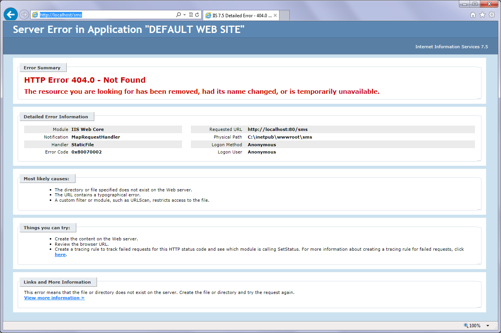 

There could be a number of reasons for this, they are all related to your browser not being able to "see" the website, and can include:

1.  The Rant web host application was not installed on the PC
2.  The URL was misspelt
3.  You are browsing the website using the wrong web server name
4.  Using an incorrect "port"
5.  If the Rantt software was installed on a different server (other than your own PC or server), it is possible you have to create appropriate firewall "rules" to allow the server to accept requests from you, particularly if you are using alternate ports, other than the default port 80 - normally used for web server requests. The image below is typical of a firewall issue:
 
6.  If Rantt was re-installed, you may get this screen, even though everything was working fine before the install.

Fixes: 

1.  Check that Rantt Web Host has been installed on the PC in question; the default installation folder is *C:\SMS Software\RanttWebSetup*  Verify that this directory exists and has folders such as App_Data and bin, etc. within it. If not, install Rantt Web Host application and try again.
2.  The default URL for a local installation, "local" means one that is on the same PC or server you are using, then the URL should be: "http://localhost/SMS/" check that the URL was typed correctly in the browser.
3. Unless you are browsing locally (on the same PC), you need to use the name of the server or the name under which the web server is registered. Commonly on an intranet, the server name is a simple, single and memorable name, such as "server" or "intranet" or "webhost". If you have installed it on a PC or server, the default name can be configured differently, but may be found by going to Control Panel, System And Security, System. Open Windows Explorer and type:  *Control Panel\System and Security\System* then press Enter. The computer name is shown as "Computer Name". eg., BALDRIC so try "http://baldric/sms" where "baldric" is your machine name.
For users in a domain, the full computer name below this entry may also be used, it will typically have the company name in it, eg., "http://baldric.acmetools.local" where baldric is the computer name and acmetools is the company name.
If still in doubt, please ask your IT staff for further assistance.
4.  If port 80, the default port used for webservers, is already in use then you could set the local IIS webserver you wish to use for Rantt Web Host to use a another different port. Common alternate ports include port 81, 90, 8000 or 8080. For example, if your PC or server was named say "Sinope", and port 81 was used, then the URL might be constructed in this way: "http://sinope:81/SMS/"
5.  Firewall settings. A symptom of firewall issues is that and you cannot browse the web server remotely (from a different PC), but can browse and use the Rantt web application "locally", on the same server or PC on which it was installed.
Firewall settings can be quite complex, and vary considerably between Windows desktop versions and Windows Server versions. If using port 80, the default web server port, it is most likely the case that the rule was disabled and simply needs to be enabled. If on the other hand, the webserver was set to a different port, then it may be necessary to either add the port 81 to the current port 80 rules, or on some version of windows desktop/windows server, create a completely new rule to cater for port 81 web server requests. This is an example below from Server 2012 where a rule was created to allow web server requests to port 81:
 
If still in doubt, contact your IT staff for further assistance.
6.  See the section "Working Rantt Web Host application stops working after reinstallation or upgrade" below.

HTTP Error 404.2 - Not Found
-----------------------------

This error appears in the web browser as you attempt to access the Rantt Web Host website:

**HTTP Error 404.2 - Not Found**

The page you are requesting cannot be served because of the ISAPI and CGI Restriction list settings on the Web server.

 

This error occurs because the Application Pool was set to .Net 4.0 Classic instead of the required .Net 4.0 Integrated Pipeline. 

To correct this issue, click Start, type **inetmgr**then press enter. Note: If you do not have inetmgr installed, follow this procedure to add the [IIS Management Console](#iis-management-console)
Once in Internet Information Server Manager open up the left hand section, through Sites, then Default Website, to reach the SMS website. Highlight SMS on the LHS, then click Advanced Settings on the RHS

Once the Advanced Settings window appears, click on the "Application Pool" to bring up the "Select Application Pool" window, then verify that the pool was set incorrectly to "ASP.Net v4.0 Classic", the incorrect settings are below:

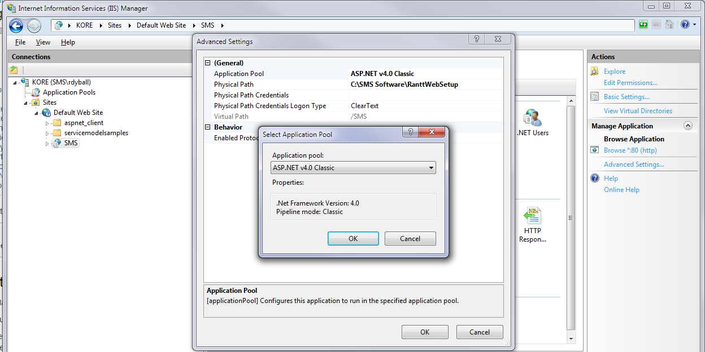 

Change the Application Pool to "ASP.Net v4.0", the "Select Application Pool" window should now appear as below:

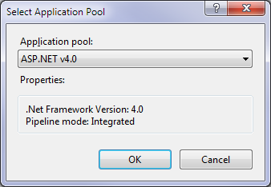

Click OK, then OK, and then close IIS Manager.

Finally, assuming there are no other issues, you should now be able to browse the website.

HTTP Error 500.19 - Internal Server Error
-----------------------------------------

This error appears in the web browser as you attempt to access the Rantt Web Host website:

**HTTP Error 500.19 - Internal Server Error**
The requested page cannot be accessed because the related confirmation data for the page is invalid.

 

The root cause of this issue is most commonly not having installed or set up ASP.Net

Please follow the detail in the section [Adding ASP.Net support to IIS Web Server](#adding-aspnet-support-to-iis-web-server) 
Then follow subsequent sections, as you will likely need to [Check and Update](#net-framework-45---how-to-check-and-update) your .Net framework , then [Configure IIS to add ASP.Net 4.0 Support and .Net4.0 Application Pools](#configuring-iis-to-add-net-40-support-and-aspnet-40-application-pools) and finally [change the Application Pool used by Rantt Web Host](#changing-the-application-pool-used-by-rantt-web-host) 

HTTP Error 500.21 - Internal Server Error
-----------------------------------------

This error appears in the web browser as you attempt to access the Rantt Web Host website:

**HTTP Error 500.21 - Internal Server Error**
Handler "ExtensionlessUrlHandler-Integrated-4.0" has a bad module "ManagedPipelineHandler" in its module list.

 

The issue here is likely that you have .Net 4.0 and .Net 4.5 installed, but have not yet [Configured IIS to add .Net 4.0 Support or .Net 4.0 Application Pools](#configuring-iis-to-add-net-40-support-and-aspnet-40-application-pools) 
You will also need to [change the Application Pool used by Rantt Web Host](#changing-the-application-pool-used-by-rantt-web-host)  

Browser Issues
======

Following are various issues that may not appear as browser errors.

Directory listing shown
-----------------------

If, after installation of the Rantt Web Host application you don't see the Rantt project browser, after navigating to [http://localhost/SMS/](http://localhost/SMS/) but instead of the Rantt project directory page you should have, as below:

 

if you see a directory listing instead, like this:

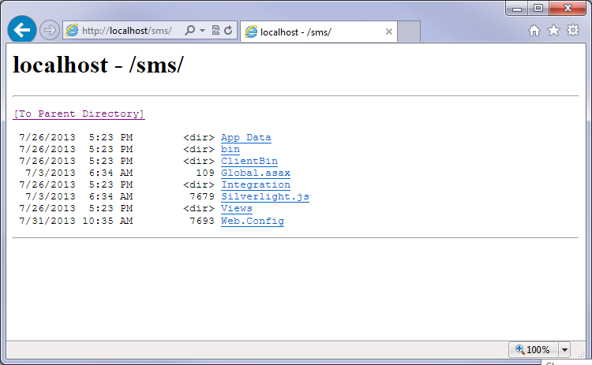 

then first follow the procedure below to [disable directory browsing](#how-to-disable-directory-browsing).

Next check that you have [.Net 4.5 installed](#net-framework-45---how-to-check-and-update), that [ASP.Net 4.0 was installed](#configuring-iis-to-add-net-40-support-and-aspnet-40-application-pools) and that [Rantt Web Host is set to use the ASP.Net 4.0 Application Pools](#changing-the-application-pool-used-by-rantt-web-host) . 

Rantt project page is blank
---------------------------

Once you have installed Rantt web host then navigating to [http://localhost/SMS/](http://localhost/SMS/) ,

 

click on a project, and if you see a blank page instead, as below:

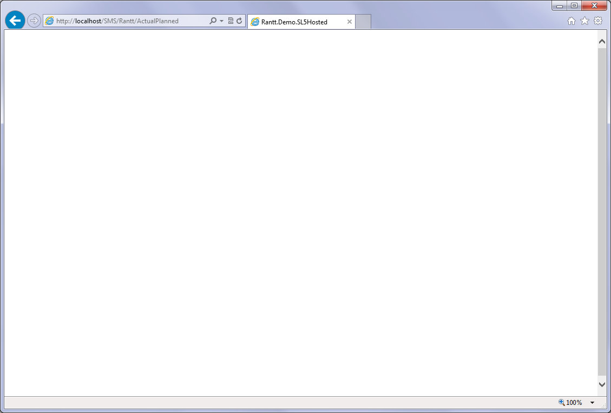 

to verify this is the same issue covered here, right click the page and you should see the Microsoft Silverlight prompt (if not review IIS installation settings)

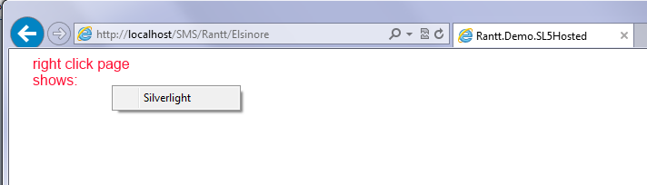 

if you see the Silverlight prompt, then you need to add a feature to the IIS web server; go to Control Panel, click Programs, "Turn Windows features on and off" and enable the "Static Content" checkbox

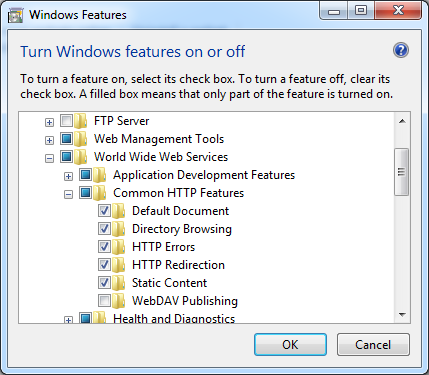 

Note: depending on other features you have installed, you might find the "Static Content" selection has embedded options; enable these too, if you have them.

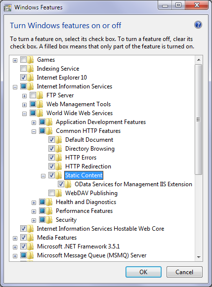 

Click OK, and then after a short pause during which the feature loads, refresh the page (or return to the Rantt project directory page, and retry) and verify that the Rantt page now loads correctly.

No data displayed
-----------------

If you select one of the projects in the Rantt web host project listing at [http://localhost/SMS](http://localhost/SMS) normally you should see the data in the Rantt project, as below:

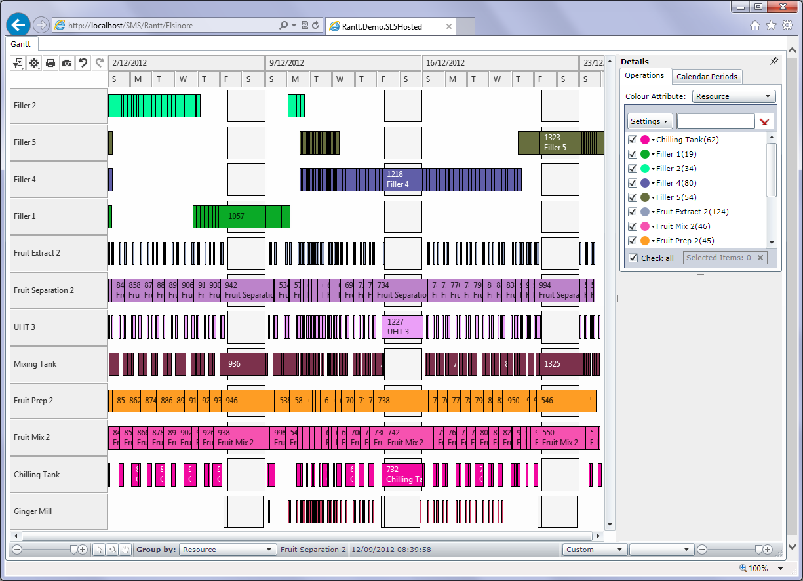 

Instead, if you so not see the data loading wait symbol highlighted below:

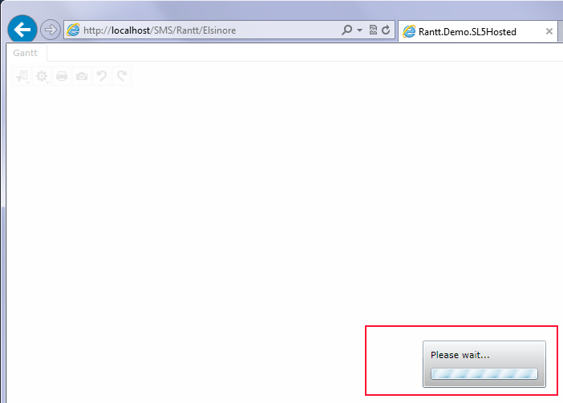 

but see a blank page, as below, with the project view frame but no data:

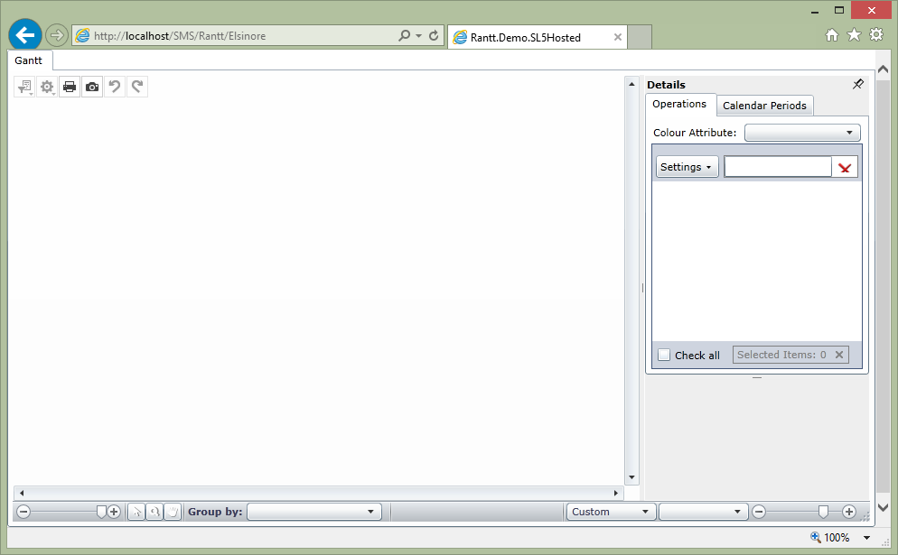 

Most the web services feature has not been enabled.

To correct this, go to Control Panel, Programs, "Turn Windows features on and off", and turn on both HTTP and non-HTTP web service features as shown below:

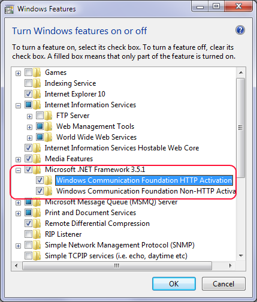 

Click OK, wait as features are loaded, do not just click refresh to reload the page, instead return to the Rantt project directory page, then click on the link to view the Rantt data page again, this time the data should be loaded correctly.

Reinstallation or upgrade
-------------------------

###Application stops working after reinstallation or upgrade

If you had a working Rantt Web Host application, then failed to work after you do a reinstallation or upgrade, unless you have changed other windows features, then the issue is most likely related to the use of ASP.Net 2.0 application pools.

Rantt Web Host application requires ASP.Net 4.0 application pools, however the default Application pool for your IIS web server can still be ASP.Net 2.0

This means subsequent installations revert back to ASP.Net 2.0; to correct this issue follow these steps: [Changing the Application Pool used by Rantt Web Host](#changing-the-application-pool-used-by-rantt-web-host)

You might also consider setting the default application pool to ASP.net 4.0, as long as this doesn't affect other web sites hosted on the PC/server.

IIS - Web Server Configuration
==============================

IIS, or Internet Information Server, is a webserver that is included with most Windows desktop and server platforms.

It is able to "serve" "flat" HTML pages as well as more intelligent "ASP.Net" pages - where actual program code is executed on the server before the web page content itself is "served" to the web browser. 

By default IIS web server itself and the IIS maintenance features are usually not enabled. They can however be easily enabled and configured to suit the requirements of Rantt Web Host. 
Please see [IIS Web Server Installation](#iis-web-server-installation) procedure below for further details. 

IIS Web Server Installation
---------------------------

If you have not already installed .Net 4.5, see the section below [.Net Framework 4.5 - How to Check and Update](#net-framework-45---how-to-check-and-update), then using Windows Update ensure that you have the latest patches and updates installed, particularly for the .Net framework.

Internet Information Server or IIS may be installed using Control Panel, click Programs, then click "Turn Windows features on and off".

In all versions of Windows, ensure that you have enabled web services features as noted here: [No data displayed when viewing a Rantt project - only a page frame](#no-data-displayed)
Note: The features listed in "Turn Windows features on and off" will vary a little between different versions of Windows. Though the screenshots below show Windows 7, these are similar other editions of windows.

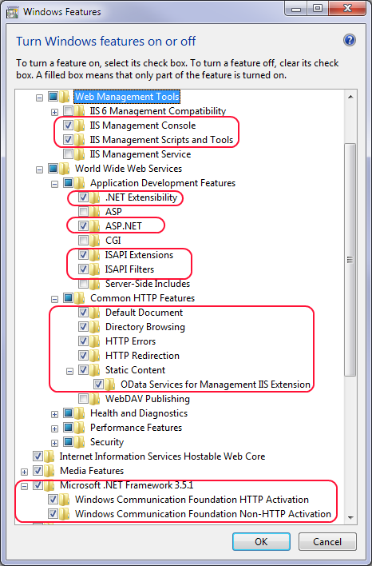 

Again, note that different editions of Windows can have different feature lists.

If using Windows 8 or Server 2012 and if present, enable both .Net 3.1 and .Net 4.5 features as shown in the Windows 8.1 Preview screenshot below:

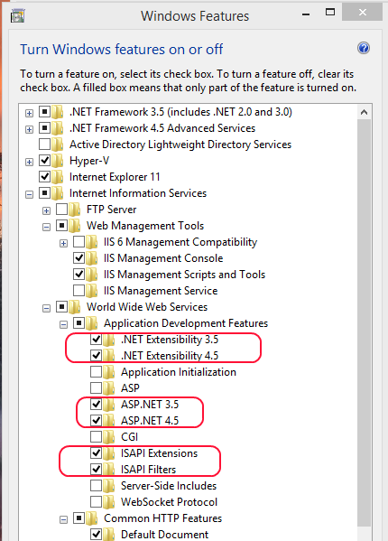 

Your installation should now be complete.

If you have not yet installed the Rantt Web Host web application, do this now ,and then browse to [http://localhost/SMS](http://localhost/SMS) on the PC/server  to verify installation was successful.

Warning: There are many settings in IIS, do not change these, apart from choosing the ASP.Net version 4.0 Application Pool (which may default to ASP.Net version 2.0 and need changing)

The default settings will usually work with Rantt Web Host, "out of the box". 

Note: Depending upon the features you have added, after installation, sometimes a reboot will be required for the features to be completely installed and activated.

IIS Management Console
----------------------

It is essential to be able to configure your webserver. Make sure you enable the IIS Management Console.

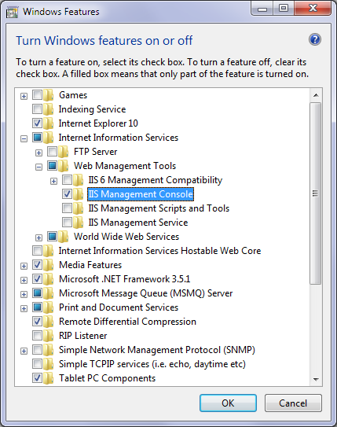 

Once installed, to run Internet Information Server Manager, just click start and type **inetmgr** and then press enter.

How to Disable Directory Browsing
---------------------------------

If "Directory Browsing" is enabled, you could have this web page shown to you:

 

instead of the normal Rantt Project page:

 

There are two places to disable Directory Browsing:

1. To disable for the Rantt web Host only:

Click Start, type **inetmgr**then press Enter. Note: If you do not have inetmgr installed, follow this procedure to add the [IIS Management Console](#iis-management-console)

Once in the Internet Information Services Manager open the section to the left to view the SMS website

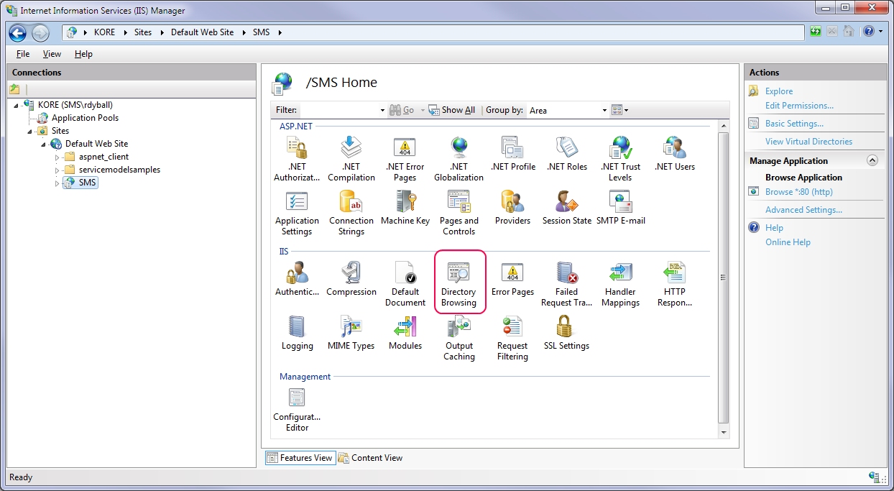 

Double click on "Directory Browsing", then you should see the following:

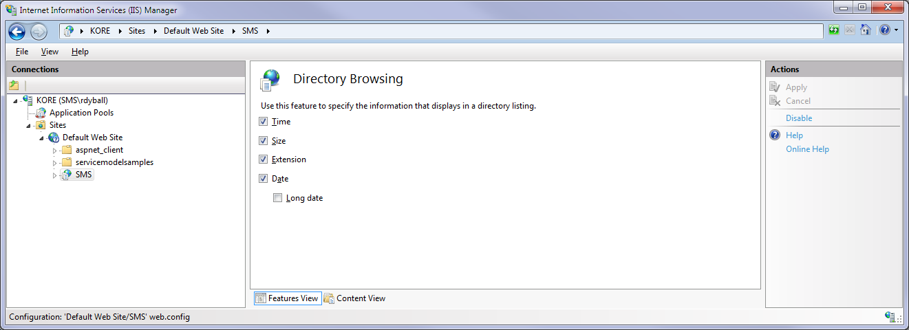 

Click on "Disable" to the right, then you should see: 

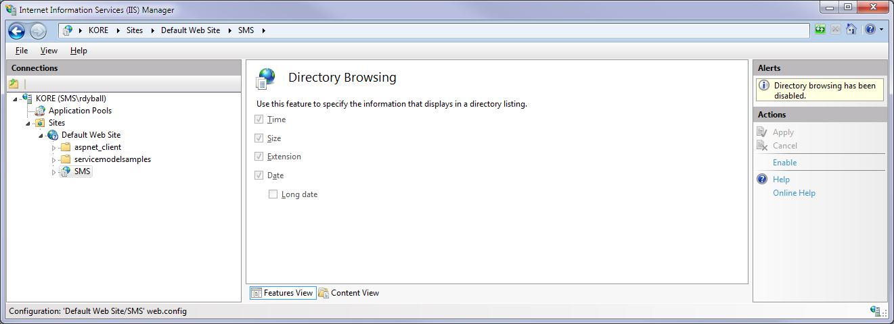 

Directory browsing on the Rantt Web Host website is now disabled.

 

​2. To disable directory browsing for all websites, including the Rantt Web Host, go to Control Panel, Programs, Windows Features

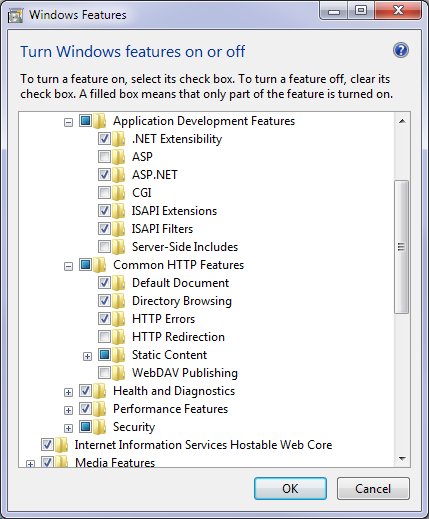 

uncheck the box marked "Directory Browsing", click OK.

Directory browsing for Rantt Web Host and all other websites on IIS are now disabled.

 

Note: A directory of files such as the directory browsing feature provides can be occasionally be useful for debugging, but should be disabled for normal day-to-day use to avoid confusion to other users.

It is also possible that the "problem" of directory browsing is just a symptom of other issues; often ASP.Net 4.0 has not been installed or configured correctly as well. See [HTTP Error 403.14 - Forbidden](#http-error-40314---forbidden) for further details.

Adding ASP.Net support to IIS Web Server
----------------------------------------

To add ASP.Net support to an existing IIS Web Server, go to Control Panel, Programs, Windows Features

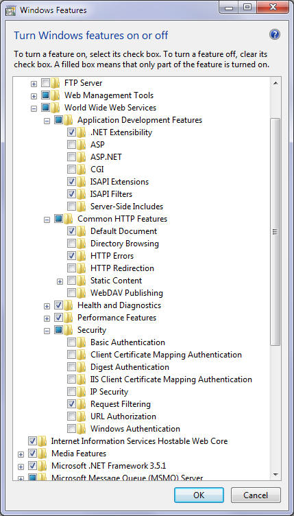 

notice above, the ASP.Net checkbox is unchecked. Click the checkbox to mark it on, click OK

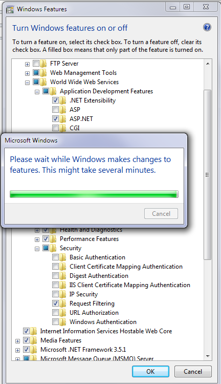 

There will be a short installation (usually less than a minute), after which the Windows Feature dialogue disappears.

Note: It would be best to check if you have [.Net Framework 4.5 installed](#net-framework-45---how-to-check-and-update) and then you should definitely [configure IIS to add .Net 4.0 Support and .Net 4.0 Application Pools](#configuring-iis-to-add-net-40-support-and-aspnet-40-application-pools)  
You will also need to [change the Application Pool used by Rantt Web Host](#changing-the-application-pool-used-by-rantt-web-host)  

Finally, assuming there are no other issues, you should now be able to browse the website.

.Net Framework 4.5 - How to Check and Update
--------------------------------------------

Download the utility program *DotNetVersionChecker.exe* from here: [http://sdrv.ms/140I5yL](http://sdrv.ms/140I5yL) 

Run the program to check the version of .Net you have installed. 
If you have .Net 4.0 and 4.5 installed then the output should be :

     v2.0.50727  2.0.50727.5420  SP2   v3.0  3.0.30729.5420  SP2     v3.5  3.5.30729.5420  SP1     v4    Client  4.5.50709     Full  4.5.50709     v4.0

If the DotNetVersionChecker does not run at all, it indicates you most likely do not have .Net 4.0 installed
If the DotNetVersionChecker gives the following output, below, you have .Net 4.0 but not .Net 4.5.

    v2.0.50727  2.0.50727.5420  SP2   v3.0  3.0.30729.5420  SP2 v3.5  3.5.30729.5420  SP1 v4    Client  4.0.30319     Full  4.0.30319 v4.0

To correct these issues, and install .Net 4.0 and .Net 4.5, go to the Microsoft download site here:

[http://www.microsoft.com/en-au/download/details.aspx?id=30653](http://www.microsoft.com/en-au/download/details.aspx?id=30653)

Download, run the installer, then once .Net 4.5 is installed, follow the steps from: [Configuring IIS to add .Net 4.0 Application Pools](#configuring-iis-to-add-net-40-support-and-aspnet-40-application-pools)
Note: You will also need to [change the Application Pool used by Rantt Web Host](#changing-the-application-pool-used-by-rantt-web-host)  

Configuring IIS
---------------

###Configuring IIS to Add .Net 4.0 Support and ASP.Net 4.0 Application Pools

If you have only just set up ASP.Net on IIS, it will default to .Net 2.0 only. Even if you have installed .Net 4.0 or .Net 4.5, IIS will continue to use .Net 2.0 and not .Net 4.0 until you configure it to do so.

Warning: if installing on a server that is used for other websites, please consult your IT staff, since setting up ASP.Net 4.0 application pools in the following could stop other websites from working if they rely on .Net 2.0 only. 
This reference provides a good starting point: [http://stackoverflow.com/questions/4890245/how-to-add-asp-net-4-0-as-application-pool-on-iis-7-windows-7](http://stackoverflow.com/questions/4890245/how-to-add-asp-net-4-0-as-application-pool-on-iis-7-windows-7)

You can verify this is an issue by clicking Start, type **inetmgr**and then run the Internet Information Services Manager.Note: If you do not have inetmgr installed, follow this procedure to add the [IIS Management Console](#iis-management-console) feature to Windows)

If you have only .Net 2.0 Application Pools, your application pools will be like this, with just two .Net 2.0 application pools shown:

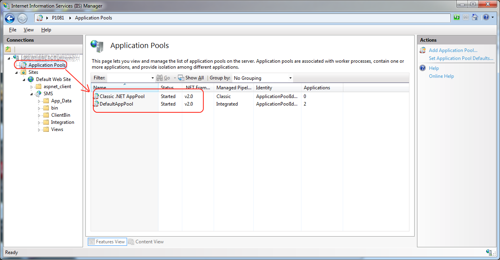 

 
The procedure to correct this is:

1. Open up a local administrator session of the Command Window

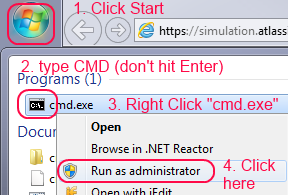 

Click start, type CMD (don't hit enter), and then when the words "cmd.exe" appears, right click cmd.exe as shown above, then click "Run as Administrator"

 

2. Type:

`cd C:WindowsMicrosoft.NETFrameworkv4.0.30319`

and press Enter, then type

`aspnet_regiis.exe -ir`

and press Enter. You can now close the command prompt window

 

3. Click Start, type **inetmgr**and then run the Internet Information Services Manager. Note: If you do not have inetmgr installed, follow this procedure to add the [IIS Management Console](#iis-management-console) feature to Windows)

You should now see the additional two .Net 4.0 Application Pools, as below: 

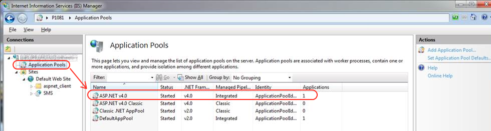 

Now that you have added .Net 4.0 Application Pools, if you have already installed the Rantt Web Host application, you will need to change the Application Pool that Rantt Web Host uses from the original ASP.Net 2.0 Application Pool, to use one of the new ASP.Net 4.0 Application Pools. See the section [Changing the Application Pool used by Rantt Web Host](#changing-the-application-pool-used-by-rantt-web-host) below

Changing the Application Pool used by Rantt Web Host
----------------------------------------------------

By default ASP.Net in IIS uses ASP.Net 2.0 and ASP.Net 2.0 Application Pools.

If you have already installed .Net 4.5, setup IIS to use .Net 4.0 Application Pools, you need to configure the Rantt Web Host application to use an ASP.Net 4.0 Application Pool.

Click Start, type **inetmgr**then hit Enter. Note: If you do not have inetmgr installed, follow this procedure to add the [IIS Management Console](#iis-management-console) feature to Windows)

Once the Internet Information Server Manager appears, as below:

To verify that this is the issue, click on Application Pools, as below:

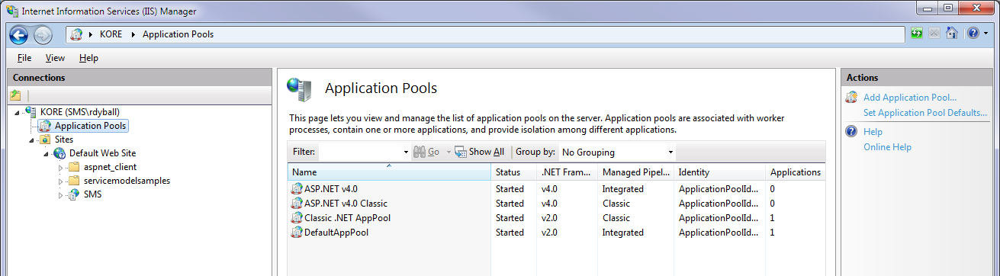 

If you do not see .Net 4.0 Application Pools present, then you need to [Configuring IIS to Add .Net 4.0 Support and ASP.Net 4.0 Application Pools](#configuring-iis-to-add-net-40-support-and-aspnet-40-application-pools) to add them first, then return here and continue below.

In the above example notice there are .Net 4.0 application pools present, but there are 0 applications using them.

To check further if this is an issue, click and expand Sites, then Default Web Site, then click on SMS.

Next click on the RHS on "Application Settings" then in the window that appears, click on the entry marked 2 below. A button labelled ".." will appear, click on this, after which a further window labelled "Select Application Pool" appears.

Shown below is a typical installation where the default Application Pool for ASP.Net 2.0 is being used. You can compare the name to the listing in the image above, or once selected you will see the .Net version and type of Application Pool in the window.

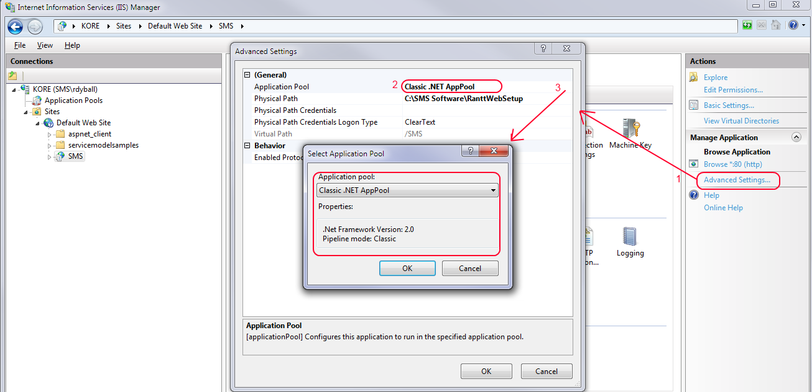 

Change the Application Pool to be one of the **ASP.Net 4.0** Application Pools, as there are two, take care to select the one that has **"Integrated Pipeline".**

This is shown below:

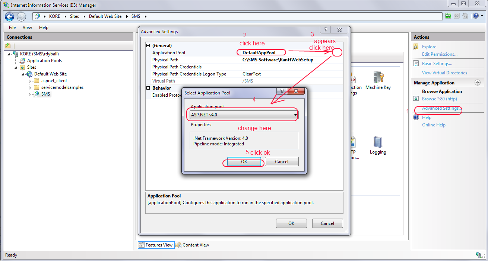 

Click OK, then OK, and then close IIS Manager.

Finally, assuming there are no other issues, you should now be able to browse the website.

Setting up an alternate port for IIS
-------------------------------------

Port 80 is the default port use by most webservers, including IIS. If your PC or server is already using this port for a different web server, or server application, it is possible to reconfigure IIS to use a different port.

It is not possible to pick a port at random and simply use it, as the alternate ports should be free and not used by other applications. Open up a local administrator session of the Command Window

 

Click start, type CMD (don't hit enter), and then when the words "cmd.exe" appears, right click cmd.exe as shown above, then click "Run as Administrator"

At the command prompt type:

    netstat  -a

then press Enter.

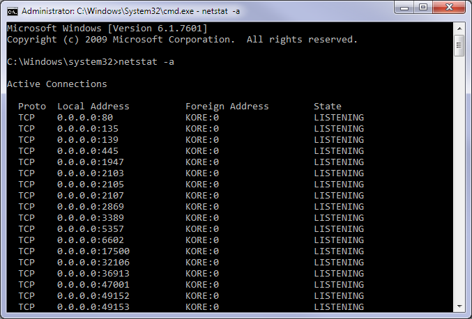 

looking through the list (the machine name here is "KORE"), you will note there is a "listener" on port 80 already.

Next, click Start, IIS and run the Internet Information Services Manager.

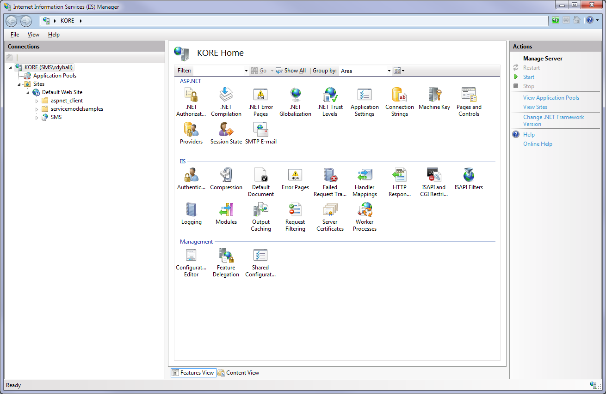 

note in the top right corner, "Start" is enabled. This means that IIS is not running. Open up the section on the top LHS, when you see "Default" Web Site", click on it. On the right hand side you will see what port your web server would be on, if it was running

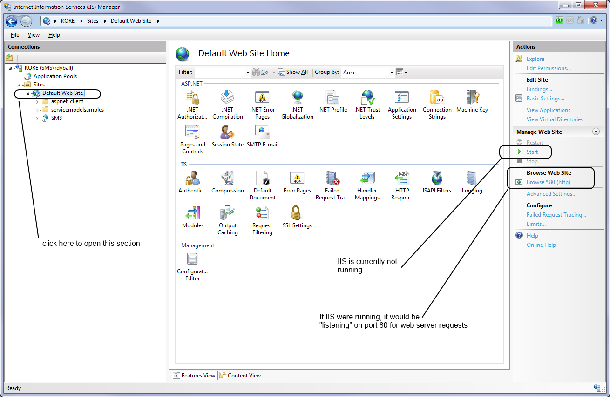 

If you have a port conflict, when you try and click "Start" you will see an error.

To correct this, choose an alternate port, after considering the *netstat -a* dump, in this example, you will see port 81, 90, or 8080, all commonly used alternate ports, happen to be free.

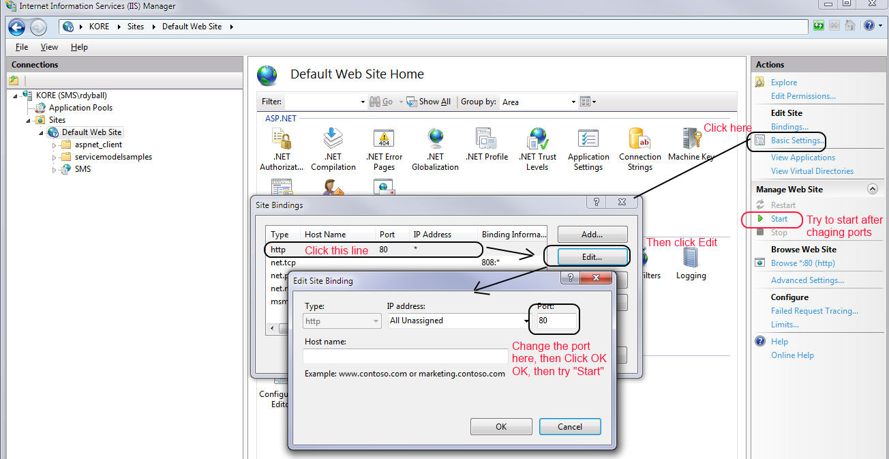 

 

Note: The procedure shown below is for Server 2012, but very similar to Windows 7, 8 or other platforms.

 

