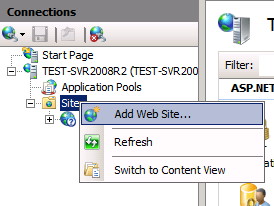
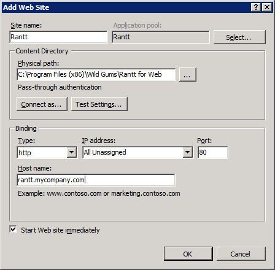
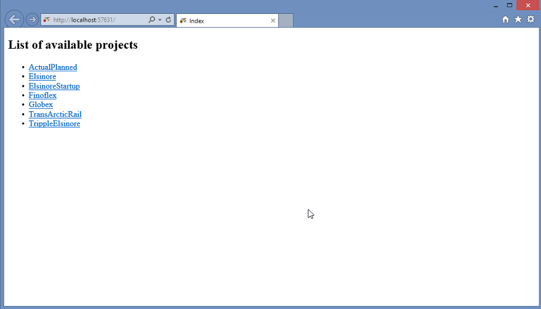
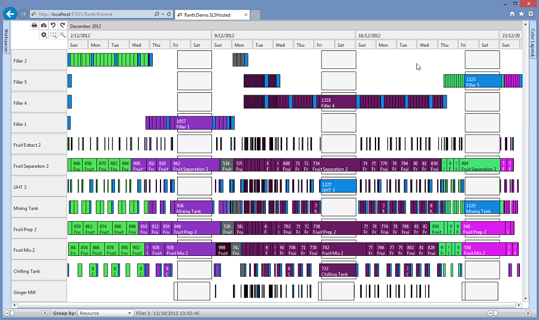
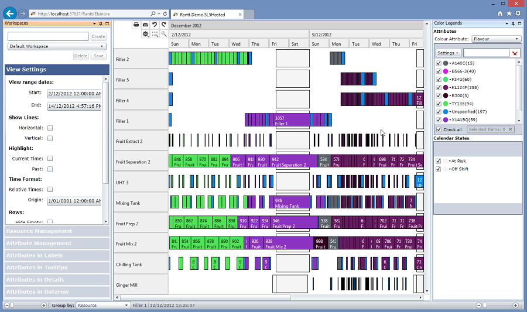

This page will contain documentation on how to install and use the stand alone web (Silverlight 5) application.

The web application shares about 90% of the same features as the desktop version.

The main exception are the **shortcut keys** which do not work in a web browser.

The purpose of the web version is more to publish results for multiple people to view.

Different views can be setup to display different information for different groups of people. (i.e. Managers, Sales force, Customers etc...)

Prerequisites
==============

-	Windows Server 2008 R2 or higher
- IIS 7 or higher
-	.NET Framework 4.5 or higher (see http://www.microsoft.com/en-us/download/details.aspx?id=30653)

Installation Steps
====================

1.	Install the website using the installer
2.	Run Internet Information Services (IIS) Manager
3.	Right click on Sites and click "Add Web Site..."
	
4. Fill in the right information as shown in the image below:
	
	
	
The installation package will create a new folder in "C:\SMS Software\RanttWebSetup" and will automatically register itself with IIS.
Once the installation is complete, you can test the installation was successful by pointing your browser to the following address:  http://localhost/???

If IIS is configured properly you should be able to see a page with some links on it, as shown int the picture below. Click on any of hose links to open a sample project:

IIS can sometimes be tricky to setup so if you have a problem displaying the page, please check the troubleshooting page. If you cannot find help there, please contact us directly on the support page.

If you click on one of the links you should see a page like the picture below:

Notes
------

The system expects the project folders to be located in the "C:\????" sub-directory.

The name of the project folder must be the same as name of the project file. (e.g. C:\SMS Software\RanttWebSetup\App_Data\ABC\ABC.rprj)

The project is then accessible from http://localhost/sms/Rantt/ABC

The desktop version of Rantt needs to be used to create projects. Click on the [ProjectWizard](http://www.resourcegantt.com/documentation/projectwizard/) page to find out more information on creating a project. 

Workspaces
==========

Workspaces created with the desktop version can be shared with the Web version (and vice versa).

The web version can open a workspace directly by appending the workspace name to the URL

TODO: Show example