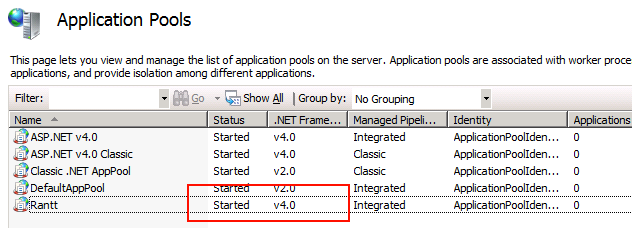

This page will contain documentation on how to install and use the stand alone web (Silverlight 5) application.

The web application shares about 90% of the same features as the desktop version.

The main exception are the **shortcut keys** which do not work in a web browser.

The purpose of the web version is more to publish results for multiple people to view.

Different views can be setup to display different information for different groups of people. (i.e. Managers, Sales force, Customers etc...)

Prerequisites
==============

- Windows Server 2008 R2 or higher
- IIS 7 or higher
- .NET Framework 4.5 or higher (see http://www.microsoft.com/en-us/download/details.aspx?id=30653)

Installation
=============

Steps
------

1.	Install the website using the installer
2.	Run Internet Information Services (IIS) Manager
3.	Right click on Sites and click "Add Web Site..."

	
	
4. Fill in the right information as shown in the image below:

	
	
5. Select "Application Pools" and ensure that the Rantt application pool is set to .NET framework v4.0
	
	
	
Notes
-------

The installation package will create a new folder in **"C:\Program Files(x86)\Wild Gums\Rantt for Web\"**.

Once the installation is complete and IIS has been properly configured you can test the installation was successful by pointing your browser to the  host name you specified in step 4.

If IIS is configured properly you should be able to see a page with some links on it, as shown int the picture below. Click on any of hose links to open a sample project:

IIS can sometimes be tricky to setup so if you have a problem displaying the page, please check the [troubleshooting](http://www.resourcegantt.com/documentation/webtroubleshooting/) page. If you cannot find help there, please contact us directly on the support page.

Projects
----------

The desktop version of Rantt needs to be used to create projects. (Click on the [ProjectWizard](http://www.resourcegantt.com/documentation/projectwizard/) page to find out more information on creating a project.)

Once the project has been created, copy the project file and the associated data files (if any) and save them in a folder that has the exact same name as the project name:

e.g. **"C:\Program Files(x86)\Wild Gums\Rantt for Web\MyProjectName\MyProjectName.rprj"**

The project will then be accessible from **http://hostName/MyProjectName/**

**Note:**

> - Multiple projects can be created and viewed with web Rantt
> - A large number of people can view a project at the same time

Workspaces
-----------

Workspaces created with the desktop version can be shared with the Web version (and vice versa).

The web version can open a workspace directly by appending the workspace name to the URL

TODO e.g. **http://hostName/MyProjectName/**